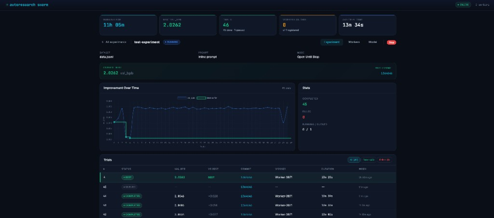
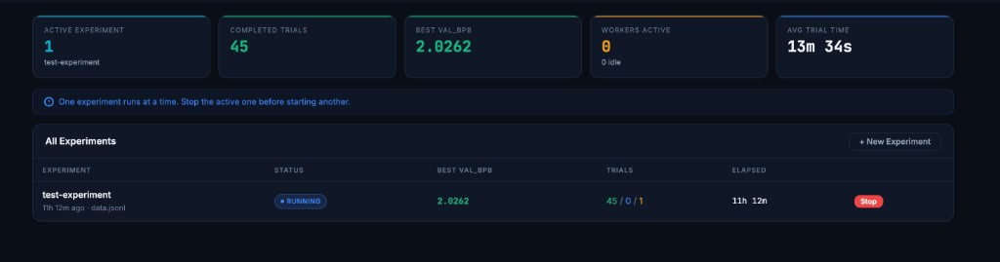

# autoresearch swarm

> Autonomous AI research across multiple GPUs — with real-time visualization.
>
> Based on [Andrej Karpathy's autoresearch](https://github.com/karpathy/autoresearch). This fork adds a **swarm orchestrator**, **worker management**, and a **live dashboard** so you can run experiments across multiple machines overnight and wake up to results.





## What's new in this fork

- **Swarm orchestrator** — FastAPI server that manages a queue of training trials across N worker machines on your LAN
- **Live dashboard** — dark-themed web UI showing real-time training/validation progress, improvement charts, worker status, and trial history
- **Phase tracking** — see warmup %, training %, and validation % as each trial runs
- **Worker resilience** — workers survive orchestrator restarts, auto-reconnect, handle stale trials
- **MPS support** — runs on Apple Silicon Macs (M1/M2/M3/M4) in addition to NVIDIA GPUs
- **Model creation** — save and test trained models directly from the dashboard
- **CLI + API parity** — everything the UI does can be done via `curl`; agents can manage experiments programmatically

## How it works

Same core loop as upstream: an AI agent edits `train.py`, trains for 5 minutes, checks `val_bpb`, keeps or discards. The difference is **scale** — multiple workers run different trials in parallel while the orchestrator tracks results and picks the best.

```
You → Create experiment → Orchestrator (API + Dashboard)
                               ↓ queue trials
Worker 1 ← claim → train → complete (val_bpb) →
Worker 2 ← claim → train → complete (val_bpb) → Orchestrator → best_commit
Worker N ← claim → train → complete (val_bpb) →
```

| | Upstream (Karpathy) | This fork |
|---|---------|-----------|
| Training | Single GPU, `uv run train.py` | Same per worker |
| Throughput | ~N trials / GPU / hour | ~N × workers trials / hour |
| Metric | `val_bpb` (lower = better) | Same |
| Visibility | `progress.png`, logs | Live dashboard + charts |
| Devices | NVIDIA GPU only | NVIDIA + Apple Silicon (MPS) |

## Quick start

### 1. Setup (same as upstream)

```bash
uv sync --extra swarm
uv run prepare.py  # one-time data download
```

### 2. Start orchestrator

```bash
.venv/bin/python -m swarm.orchestrator --host 0.0.0.0 --port 8765 --db runs/swarm.db --repo .
```

Open `http://localhost:8765` for the dashboard.

### 3. Start workers (on each GPU machine)

```bash
TRAIN_TIMEOUT=3600 .venv/bin/python -m swarm.worker \
  --server http://orchestrator-ip:8765 \
  --repo /path/to/autoresearch \
  --heartbeat-interval 10
```

### 4. Create and run an experiment

Via dashboard UI, or via CLI:

```bash
# Create
curl -X POST http://localhost:8765/api/test-experiment

# Start
curl -X POST http://localhost:8765/api/experiments/{id}/start

# Watch results
curl http://localhost:8765/api/experiments/{id}

# Stop
curl -X POST http://localhost:8765/api/experiments/{id}/stop
```

## Project structure

```
prepare.py          — data prep + evaluation (upstream, do not modify)
train.py            — model + training loop (agent modifies this)
program.md          — agent instructions (human modifies this)
swarm/
  orchestrator.py   — FastAPI server (queue, DB, API, dashboard)
  worker.py         — worker process (register, claim, train, complete)
  agent.py          — agent runner interface (cursor-agent, shell, etc.)
  schema.sql        — SQLite table definitions
  db.py             — database helper
  templates/        — Jinja2 + HTMX dashboard templates
  static/           — CSS
tests/
  test_api.py       — API integration tests
  test_agent.py     — agent runner tests
  test_e2e.py       — end-to-end golden path
  test_ui_playwright.py — browser UI tests
  e2e/              — toy training fixtures
runs/
  swarm.db          — SQLite database (auto-created)
  experiments/      — uploaded datasets + prompts
docs/
  plans/            — design documents
  ui-mockup.html    — interactive UI mockup
```

## API reference

See [SWARM.md](SWARM.md) for full API documentation with `curl` examples for every endpoint.

## Credits

This project is a fork of [karpathy/autoresearch](https://github.com/karpathy/autoresearch) — the original autonomous AI research framework. All credit for the core training loop, evaluation metric (`val_bpb`), and the brilliant idea of letting AI agents iterate on their own training code goes to [Andrej Karpathy](https://github.com/karpathy).

## License

MIT
