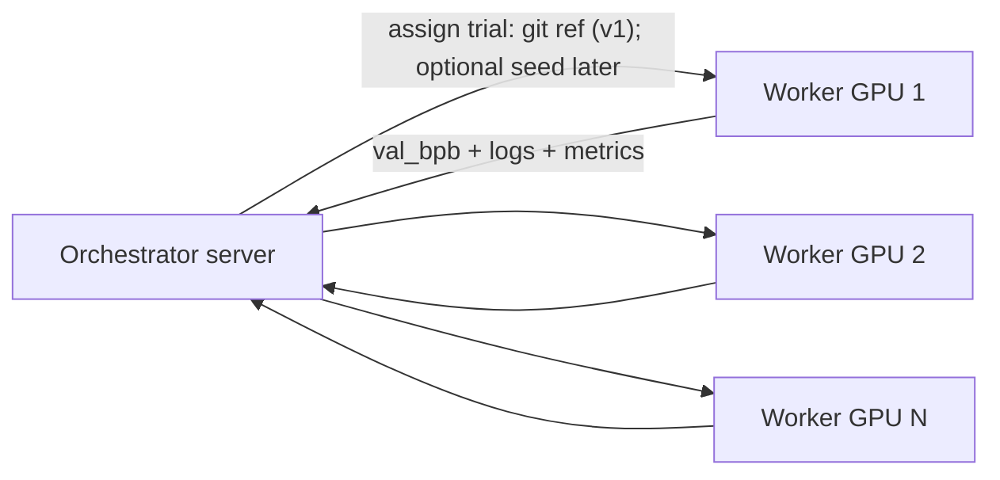
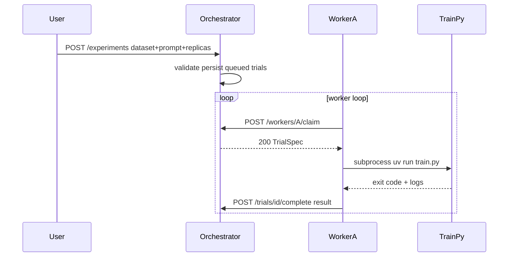

# Phase 1 — autoresearch fork: swarm orchestrator (API + CLI + worker)

**Sibling plan (execute after Phase 1 is verified):** [swarm_ui_dashboard.plan.md](swarm_ui_dashboard.plan.md) — **HTML dashboard**, **Playwright** Flow B, **charts in browser**. UI = **visibility + triggers** only; **logic lives here (API) and in workers.**

**This document scope:** **No** required HTML UI for “done”; **OpenAPI + REST + `curl` / `swarmctl`** are the **product surface** for Phase 1. Optional **`GET /docs`** only.

## Product definition (what this fork is)

**One-liner (Phase 1):** Same autonomous-research loop as [karpathy/autoresearch](https://github.com/karpathy/autoresearch), but with **parallel experiment throughput** across multiple machines via **API + CLI + workers**. **Plots in browser / HTML dashboard** → [swarm_ui_dashboard.plan.md](swarm_ui_dashboard.plan.md).

**Non-goals for v1:** Multi-GPU **single-job** distributed training (DDP/FSDP) as the default—that would break the “one comparable 5-minute trial per worker” story unless explicitly scoped as a separate experimental mode later.

**Core invariant (preserve from upstream):** Each worker still runs `[train.py](train.py)` against `[prepare.py](prepare.py)` constraints; the metric remains `**val_bpb`** after `[TIME_BUDGET](prepare.py)` from `[train.py](train.py)` (line ~603–622 pattern). The **orchestrator does not replace** the training loop—it **schedules** runs and **collects** artifacts.




**Why it is “attractive”:** Users keep the upstream mental model (one file to edit, one metric), but overnight they get **N× more completed trials** when they have N GPUs on a LAN, plus a **single place** to see curves and compare experiments.

---

## README updates (concrete sections to add)

Target file: `[README.md](README.md)`.

1. **Fork banner** — Short paragraph at the top: this is `avizaviz/autoresearch`, fork of Karpathy’s repo, with swarm + viz; link upstream.
2. **Relationship to upstream** — Table or bullets: what is unchanged (`prepare.py` contract, `train.py` as research surface, `val_bpb`, time budget) vs what is new (orchestrator, workers, dashboards).
3. **Swarm mode (parallel trials)** — Prerequisites: same Python/`uv` setup on each node, shared or replicated `~/.cache/autoresearch` data (document **rsync once** or **shared NFS**—pick one default in docs).
4. **Visualization** — v1: where plots land (e.g. `runs/<id>/`) and how to open; v2: optional web UI URL when server is running.
5. **Quick start (fork)** — Commands: start orchestrator, register workers, submit a “batch” of trials (CLI), view results.
6. **Notable forks** — Either append this fork to upstream’s list **in your README only**, or add a “Upstream README” link; do not claim to be an official Karpathy fork beyond attribution.

Optional: add `[SWARM.md](SWARM.md)` or `[docs/swarm.md](docs/swarm.md)` if README grows too large (keep `[README.md](README.md)` as the entry point with links).

---

## How the server delegates experiments to nodes (exact mechanism)

The server is **not** SSHing into nodes and **not** running `train.py` remotely by default. Each **node runs a small worker process** on that machine; the worker is the only thing that starts `uv run train.py` locally. The server **only stores the queue and hands out job specs** (plus optional auth). This keeps GPU drivers and PyTorch on the machine that owns the GPU.

### Roles


| Component                   | Runs where                                    | Responsibility                                                                       |
| --------------------------- | --------------------------------------------- | ------------------------------------------------------------------------------------ |
| **Orchestrator (HTTP API)** | One machine (often CPU-only; can be a laptop) | Persistent queue, trial state, results DB, optional dashboard                        |
| **Worker agent**            | Each GPU machine                              | Register, **claim** next job, execute `train.py`, **report** outcome + paths to logs |


### Recommended v1 pattern: **claim + complete** (REST)

Avoid “server pushes code to nodes.” Use **pull + claim** so workers work through firewalls on a LAN and you do not need open inbound ports on workers.

1. **Persist inputs, then Start (status only)** — **Dataset** and **prompt** are **uploaded/saved first** (draft experiment or `experiments` row with `status = draft` / `stopped`). **`Start` is disabled** until both are present and valid. **`POST …/start` (or `PATCH` status)** sets **`experiments.status = running`** and swaps UI to **Stop** — **it does not** upload files or **insert `trials` by itself** in the **demand-driven** product; **`trials`** appear via **refill** (below). **`Stop`** sets **`running` → `stopped`/`stopping`** and **halts refill**. **Legacy / `fixed_count`:** optional path may insert **N** `trials` on first refill tick or via explicit mode — document which. **Scripts** may call lower-level APIs.
2. **Worker starts** — On each node: `uv run python -m swarm.worker --server http://orchestrator:8765 --token <shared-secret> --repo /path/to/autoresearch` (exact CLI TBD). The worker process **stays up** in a loop.
3. **Claim (delegation step)** — Worker repeatedly calls e.g. `**POST /api/workers/{worker_id}/claim`**. The server, in one DB transaction:
  - finds one row with status `**queued`** (FIFO or priority),
  - sets it to `**running`**, records `worker_id`, `started_at`,
  - returns `**200`** + full `**TrialSpec`** for that trial,
  - or `**204 No Content`** if the queue is empty (worker sleeps a few seconds and tries again).
   This is **how delegation is implemented**: the “assignment” is the HTTP response body of **claim**, not a separate push channel.
4. **Execute locally** — Worker checks out `git_ref` if specified, sets env vars, runs `**uv run train.py`** as a **subprocess** in `repo_root`, captures stdout/stderr to `runs/<trial_id>/` on that node (or streams a copy to the server—implementation choice).
5. **Complete** — Worker calls e.g. `**POST /api/trials/{trial_id}/complete`** with JSON: `exit_code`, parsed `**val_bpb`** (or `null` if failed), optional paths or inline tail of stderr. Server sets status `**completed`** or `**failed`** and stores metrics for the leaderboard.
6. **Loop** — Worker goes back to step 3 (claim next job).

### Result reporting (worker → server) — already required for the plan

This is the **feedback path** so the orchestrator (and UI) see outcomes **without** polling worker disks.

**Request body (illustrative, extend as needed):**

- `exit_code` (int), `val_bpb` (float | null), `duration_seconds` (float | null), `stderr_tail` (string | null)
- Optional: `metrics_json` (e.g. extra parsed lines), `log_uri` / artifact references

**Server:** Persists to **`trials`** row, updates **`experiments`** aggregates if any, drives **charts** (**AT-20**) and **leaderboard**.

### End-to-end flow (v1) — matches your mental model with two corrections

1. **Where “the new `train.py`” lives:** It is **not** uploaded as a separate file to the orchestrator. The **research loop** still edits the single path **`train.py`** inside a **git repo** (fork clone on the orchestrator side for the agent, and on each worker). A **new experiment step** = **new git commit** (new snapshot of that file). The **server stores** `git_commit` **hashes** + queue state + metrics in **`runs/swarm.db`** — **not** a copy of `train.py` bytes (git is the source of truth).

2. **How many SHAs in the queue:** For **sequential autoresearch**, you usually **do not** pre-create **many** commits **in advance** — the **next** code change often **does not exist** until the **agent/human** sees **`complete`** results and commits again. So the typical pattern is **complete → policy/agent produces next commit → INSERT one new `queued` row** (sometimes **zero** rows waiting if nothing is ready yet). **Fixed batch at Start** can insert **N** rows **if** those **N** commits **already exist** on a branch (e.g. user prepared a branch). The queue is **durable job tickets** (`queued` → `running` → `completed` / `failed`), not “every possible future SHA.”

3. **Claim:** Worker calls **`claim`**; server picks one **`queued`** row in a **transaction**, sets **`running`**, binds **`worker_id`**, returns **`TrialSpec`** (includes **`git_ref` / `git_commit`**). **No other worker** gets that row.

4. **Execute:** Worker **`git checkout <SHA>`** in its local repo, runs **`uv run train.py`**, captures logs (e.g. under `runs/<trial_id>/` on the worker).

5. **Complete:** Worker **`POST …/complete`** with **`val_bpb`**, **`exit_code`**, etc. Server updates the **`trials`** row and can update **`experiments`** (e.g. **best `val_bpb`**, **best `git_commit`**).

6. **UI:** Reflects queue, per-trial status, leaderboard, **best-so-far** — same spirit as upstream **`results.tsv`**, centralized.

**Status is on the `trials` row, not on git:** Git does **not** know “running vs done.” The orchestrator stores **`trials.status`** (and timestamps / `worker_id`) for each job. The row **references** `git_commit` (or resolves it after checkout). **Mapping:**

| `trials.status` | Meaning |
|-----------------|--------|
| **`queued`** | This SHA is **next to run** — waiting for a worker **`claim`**. |
| **`running`** | A worker **claimed** it (`worker_id`, `started_at` set); work **in progress**. Stale if **`last_heartbeat_at`** too old — see **Stuck / crashed workers**. |
| **`completed`** | **`complete`** received; **`val_bpb`** (etc.) stored. |
| **`failed`** | Run finished with error / parse failure; optional stderr. |
| **`cancelled`** | Removed from queue before run (user stop) or superseded (policy). |

**v1 invariant:** At most **one** non-terminal row per **`git_commit`** per experiment (no duplicate “fresh + running” for the same SHA). “Fresh SHA” = **new commit** just **INSERT**ed as **`queued`**; “done” = that row **`completed`** / **`failed`**.

### Unknown total trial count — you usually **do not** pre-create “enough” commits upfront

**The weak spot you’re sensing** only appears if you assume **all** future SHAs must exist **before** the run starts. The design **avoids** that for the main autoresearch loop.

| Situation | How many `trials` rows / commits to prepare | What if it runs longer than expected? |
|-----------|----------------------------------------------|----------------------------------------|
| **`fixed_count` / fixed batch** | **N** is chosen at **Start** (`replica_count`). Each row needs a **resolvable `git_commit`** (branch already has **N** commits, or stubs). | **Not** extended automatically — user starts a **new** experiment or you add **“append K more trials”** API later. |
| **`open_until_stop` or `duration_limited`** | **Initial batch** only (e.g. small buffer). Total trials **not** fixed at Start. | Orchestrator **keeps inserting** `queued` rows while `experiment.status` is active and **stop/deadline** not hit — **refill** when queue depth &lt; **min_queue_depth** *for modes where specs exist without waiting on agent* (see sweep). |
| **`sequential_autoresearch` (default story)** | **Do not** pre-create a deep stack. **One** new row **after each `complete`** when the **next commit SHA exists** (agent just pushed). | If the queue is **empty** and workers **idle**, that’s **normal** until the agent commits the next SHA — not “not enough trials,” **waiting for the next artifact**. |

**Managing “not enough” mid-run:** For **dependent** chains, the limiter is **how fast the agent can commit**, not DB capacity — **INSERT** the next row when the SHA exists. For **continuous non-dependent** modes, **refill** tops up **queued** rows from a **policy template** (documented). **UI** shows **experiment active** + **queue depth** + **workers idle** so “long test” doesn’t look like failure.

**Acceptance tests:** Prefer **fast mock `train.py`**, **short time budget**, or **DB/API fixtures** that insert `trials` **without** requiring dozens of real git commits — **AT** count is **not** “how many SHAs you manually committed.”

### Demand-driven trial materialization (aligned with your proposal)

**What you described — yes, with one dependency caveat below.**

1. **Upload (before Start):** User uploads **dataset** + **prompt**; server persists under a documented layout (e.g. `runs/experiments/<id>/…`). **Start** button **disabled** until both are saved and validation passes.

2. **Start (status flip only):** **`POST …/start`** sets **`experiments.status = running`** only — **no** `trials` rows required at this API call. UI shows **Stop** instead of **Start**. **Stop** sets status to **stopped** / **stopping** and **must** stop **refill** (see below).

3. **Refill (only while `running`):** Background loop (or tick on **`claim`**) runs **only if** **`experiments.status = running`** **and** **`Stop` has not been pressed** (and time limit not exceeded if applicable). If **`queued` count** &lt; **`min_queue_depth`** (and policy allows), **INSERT** new **`trials`** / invoke **agent** to materialize SHAs. **When status is not `running`**, **no refill** — queue may stay empty indefinitely.

4. **Workers** loop **`claim`**. When **`claim`** returns **204** (no job), worker is **waiting** — UI counts **idle / waiting** workers (**AT-11**).

5. **Refill / batching (detail):** Track **`demand`** (e.g. **idle workers**, **`min_queue_depth`**). **Top up** **`queued` `trials`** in **batches** while **running** — **without** pre-materializing all SHAs at Start.

6. **How new SHAs appear:** **Singleton-guarded** **agent runner** (shell or `uv run …`) reads **prompt file**, **dataset ref**, **history** — **one new commit** per step. **Global lock** so **at most one** agent at a time.

7. **Trigger timing:** **(A)** Refill loop while **`running`**: if **`queued` &lt; min_queue_depth`** and lock free → agent step(s). **(B)** **`claim`** with empty queue → **204**; may **nudge** refill (same gate: **`running`** only).

8. **Caveat — sequential autoresearch:** Next trial may depend on **`complete`** — batch size often **1** per result unless parallel branches — document mode.

9. **UI:** **Start** disabled without dataset + prompt; **Stop** when running; **workers waiting**, **`queued` depth**, **agent busy** (optional).

**Implementation notes:** **Claim** stays **transactionally safe** — **`trials` rows** must exist **with** `git_commit` **before** a worker can claim them (agent finished **or** row points at **prepared** branch). **Single-flight agent** is a **hard** requirement if one repo / one branch.

### Trial dependence (v1 = sequential autoresearch only)

For real **autoresearch**, the next trial often **depends** on prior outcomes — agent edits `train.py` using `val_bpb`, success/failure, or logs. **v1 supports only `sequential_autoresearch`:** complete-driven enqueue, one logical next trial at a time, unique `git_commit` per trial.

**After each `complete`:** Server (or policy hook) runs `plan_next_trial(experiment, last_trial)` and INSERTs the next `queued` row (often one at a time). Refill is driven by results, not a blind timer.

**Failure / success policy:** On failure → retry, skip, or revert. On success → propose next edit or stop if improvement < threshold.

**Duplicate work prevention:** Each `queued` trial references a unique `git_commit`. Enforce at most one `queued`/`running` row per SHA per experiment.

**Deferred (not v1):** `parallel_sweep` (same SHA + different seeds/hparams in parallel) — only if you later want same-SHA variance studies. All sweep-related paragraphs from earlier plan iterations are collapsed here as out-of-scope context.

### Why use a **queue** (rows in DB) at all vs **pure on-demand** at `claim`?

**“On demand”** can mean two things: (1) **create the next `trials` row only when a worker calls `claim`** (no rows sitting in `queued`), or (2) **create the row right after `complete`** (still “on demand” relative to results, but the row exists before the next `claim`). The plan already mixes both.

| | **Materialized queue (`queued` rows exist)** | **Pure on-demand (no row until `claim`)** |
|---|---------------------------------------------|-------------------------------------------|
| **Pros** | Visible **queue depth** in UI; **FIFO** is trivial; **claim** stays a simple **dequeue**; easy **cancel** of not-yet-run work; metrics “how much left”. | **No** speculative rows if user stops early; spec always **as late as possible** (max fresh state). |
| **Cons** | Pre-created rows for **parallel sweep** can be “wasted” if stopped (acceptable: mark cancelled). | **`claim`** must run **policy + INSERT + assign** in one transaction; harder to test; UI shows **empty** queue until claim runs (unless you fake “pending”). |

**For `sequential_autoresearch`**, you are **already** mostly **on-demand**: the next row appears **after** `complete`, not as a deep pre-built queue. The **queue** is just **one row** (or a few with worktrees) as a **durable contract** of what the worker will run next.

**For `parallel_sweep`**, **prefill** helps keep **many workers** busy without the server doing **N policy calls** at the same moment as **N claims**.

**Bottom line:** Rows in DB are not only “batch in advance”—they are **durable job tickets**. You can implement **claim-time INSERT** instead if you accept heavier `claim` and weaker “upcoming work” visibility; the plan’s **complete-driven INSERT** is a middle ground: **on demand from results**, still **materialized** before the next **claim**.

### Using results to plan the next trial (summary)

| Scenario | Uses `complete` results? | When next `trials` row appears |
|----------|--------------------------|--------------------------------|
| **Parallel sweep** | Stored for charts; **not** required for enqueue | Refill/timer can add rows **without** reading last `val_bpb`. |
| **Sequential autoresearch** | **Required** — policy reads `val_bpb`, `exit_code`, logs | **After `complete`**, policy inserts **next** row (or stops). |

So: **yes, the plan already includes sending results when done** (`complete`). For **dependent** workflows, **using** those results to enqueue the next trial is **core**, not “v2 optional”—it is **policy** (built-in rules vs external agent in v2).

---

## Git hygiene: research commits vs project commits (upstream + open source)

**How Karpathy’s repo avoids mix-ups** ([`program.md`](program.md)):

- **Dedicated research branch:** `**autoresearch/<tag>**` (e.g. `autoresearch/mar5`) is **created from `master`** for each run — all **noisy experiment commits** live there, not on `master`.
- **Only `train.py`** is edited by the autonomous researcher (per loop); **`prepare.py`** is off-limits; **`results.tsv` is explicitly not committed** (untracked) so metrics don’t pollute git.
- **Humans** iterate **`program.md`** (and README, etc.) on **`master`** or normal feature branches — **orthogonal** to the agent’s `train.py` line on `autoresearch/…`.
- **Advance / revert** stays **on the research branch** (`git reset` when discarding), so **`master`** can remain a **clean** baseline for others to clone.

**For this fork (swarm + infra + OSS):**

- **Orchestrator / worker / UI code** — develop on **`main`** (or `master`) and **feature branches**; **PRs** bring **infrastructure** only — same as any OSS project.
- **Autoresearch runs** — point the **agent** (and workers’ **`git checkout`**) at an **`autoresearch/<tag>`**-style branch (or a **fork** used only for experiments) so **hundreds of `train.py` SHAs** never need to merge into **`main`**.
- **Optional hard separation:** **two clones** — one repo checkout for **maintaining** the swarm code; another (or a bare **research remote**) for **long-running** agent commits — eliminates accidental `git pull` mixing experiment state with dev work.
- **Document in README:** contributors **PR to `main`** for product code; **research branches** are **ephemeral / optional publish** — if you share a “winning” result, **cherry-pick** or **open a PR** with **one** clean commit rather than merging the whole experiment history.

**Avoiding accidental `train.py` commits on `main` (operator anxiety):**

- **Default `git_ref` in orchestrator / worker config** — e.g. **`autoresearch/<tag>`** or **`experiment/<id>`**, **never** bare `main` for agent-driven runs; document the one-liner to create/switch branch before **Start**.
- **Separate working tree** (optional) — **second clone** of the repo checked out **only** on `autoresearch/…` for runs; **`main`** clone used only for swarm development.
- **GitHub/GitLab:** **branch protection** on **`main`** — **no direct push**, **PR required**, optional **required reviewers** for anything touching **`train.py`**.
- **Local habit:** **`git branch --show-current`** before agent/refill; add **shell prompt** showing branch (most themes do this).
- **Pre-commit hook (optional, strict):** on **`main`**, warn or block commits that modify **`train.py`** unless **`ALLOW_TRAIN_ON_MAIN=1`** — opt-in escape hatch for rare manual edits.

---

## Multi-worker autoresearch: who owns `train.py` (keep vs revert)?

**Upstream mental model:** One process edits **`train.py`**, runs **~5 min + val**, compares **`val_bpb`**, **keeps** the commit if better else **reverts**—single git working tree.

**With multiple workers**, you cannot safely have **two** workers both editing the **same** `main` checkout without coordination. The plan separates **roles**:

| Role | Responsibility |
|------|------------------|
| **Worker** | **Execute** a **pinned** snapshot: `git fetch && git checkout <commit>` (or unpack artifact), `uv run train.py`, **`complete`** with `val_bpb`. **Does not** decide keep/revert or author the *next* edit—unless the fork explicitly gives each worker an **isolated clone/worktree** (see below). |
| **Orchestrator / policy / agent** | After **`complete`**, decides **keep vs discard** vs **try another variant**; **authors** the next `train.py` state as a **new git commit** (or branch) and stores it so the **next `TrialSpec`** carries **`git_commit`** / `branch` / patch id. This can run **on the server** (recommended) or on **one** designated “writer” service—not racing workers on the same bare repo. |

**Where the new `train.py` is created (recommended v1):**

1. **`complete` arrives** with `val_bpb`, logs.
2. **Policy** compares to **current best** for that experiment (stored in DB or **`best_commit`** ref).
3. **If worse:** no merge to main; optionally **revert** local branch or simply **do not advance** `best_commit`; **agent** proposes a **new** edit from **base = best_commit** (or from failed attempt’s parent).
4. **If better:** **`best_commit` ← this trial’s commit**; mainline for the experiment advances.
5. **Agent** (Codex/Claude/API or subprocess on server) **writes** patch, **`git commit`**, **push** to team remote **or** server stores **commit bundle** in `runs/experiments/.../repos/`.
6. **`plan_next_trial`** inserts **`queued`** row with **`git_commit`** = new SHA for the **next** worker to run.

**Multiple workers without conflict:**

- **Sequential chain (one improvement at a time):** **At most one** `running` trial that **mutates** the shared lineage, **or** all workers run **read-only** evaluation of commits produced **only** by the orchestrator-side agent.
- **Parallel exploration:** **K** workers each run **different branches** `trial/<id>` from the same **base** commit; **each** trial has its own `train.py` variant; **after** results, **policy** picks winner and **merges** to `main` / updates `best_commit`. **K** can be &gt;1 safely.

**Summary:** **Workers run code; the orchestrator-side policy + agent (or a single writer) produces the next `train.py` as a new commit** referenced by the next `TrialSpec`. **Keep/revert** is **git-level** (merge or not) + **DB pointer** to best experiment state—not “worker B overwrites worker A’s file.”

---

## Git iteration: workers pull a **SHA**, not “whatever is latest”

This section resolves the confusion: **workers do not guess “latest greatest” by pulling `main` blindly**, and **workers do not author** the next `train.py` in the recommended sequential loop.

### Misconceptions to avoid

| Wrong mental model | Why it breaks |
|--------------------|---------------|
| Worker always **`git pull`** on `main` to get “latest” | **Races:** two workers see different times; “latest” is ambiguous without an exact **commit SHA**. |
| Worker **writes** the improved `train.py` for the next trial | **Conflicts** if two workers edit the same lineage; mixes **execution** with **research**. |
| Each trial starts **from blank** `train.py` | Loses the point of autoresearch—you want **incremental** improvement from a **known good** (or from a fixed **baseline** once at start). |

### Correct mental model

1. **Source of truth** is **git**: every runnable state is an **immutable commit** (identified by **SHA**).
2. **`latest greatest`** for an experiment = **`best_commit`** (a SHA stored in DB or on a branch like `autoresearch/<exp>/best`), meaning “best **`val_bpb`** seen so far** under your policy—not necessarily “tip of `main`.”
3. **Worker** receives **`TrialSpec.git_commit`** = **one exact SHA**. It runs:
   - `git fetch` (from the **remote** you configure, e.g. GitHub or **internal bare repo on orchestrator**),
   - `git checkout <that SHA>` (detached OK),
   - `uv run train.py`,
   - **`complete`** with metrics.
   **No** “pull latest” without a SHA.

### Process: rewriting `train.py` — who is responsible? (step-by-step)

| Step | Who | What happens |
|------|-----|----------------|
| 1 | **Worker** | Runs **`train.py` as-is** at **`TrialSpec.git_commit`** (no rewrite during the run unless your script self-modifies—discouraged). |
| 2 | **Worker** | **`POST …/complete`** with `val_bpb`, exit code, logs. |
| 3 | **Orchestrator — policy** | Compares result to **`best_commit`** / rules (keep vs discard; stop or continue). |
| 4 | **Orchestrator — agent** (LLM or scripted editor) | **Rewrites** `train.py` on a **git checkout of the chosen base** (usually **`best_commit`**): applies the *next* research edit (same idea as solo autoresearch). |
| 5 | **Orchestrator** | **`git commit`** (+ **`git push`** to your remote). New SHA = next candidate code. |
| 6 | **Orchestrator** | **`plan_next_trial`** enqueues **`queued`** row with **`git_commit` = new SHA**. |
| 7 | **Worker** (same or another) | **`claim`** → receives **`TrialSpec`** → **`git checkout`** that SHA → runs training again. |

**Single sentence:** **Only the orchestrator-side policy + agent rewrites `train.py` for the next trial; workers execute a fixed commit and report results.**

### “Experiment” vs “generates `train.py`”

- In this architecture, a **trial** (one queued job) is **one run** of a **pinned codebase**, mainly identified by **`git_commit`** (the `train.py` at that commit, plus rest of repo). **Dataset/prompt** live in **`TrialSpec`** too.
- When we say the **orchestrator generates the next experiment**, for **sequential autoresearch** we usually mean: it **produces one new commit** (one new candidate `train.py` state) for the **next** trial—not necessarily **many** different `train.py`s at the same instant.
- **Parallel exploration:** the orchestrator **can** create **K different commits** (K branches / variants) so **K workers** run **K different** `train.py` candidates **at the same time**; then **policy** picks a winner and updates **`best_commit`**. That is **multiple** train.py states, **on purpose** (competing ideas), not “one train.py copied to every worker.”

### Who creates the **next** `train.py` (the next commit)?

**Not the worker** (in sequential autoresearch). **After `complete`**, the **orchestrator** (policy + **agent**):

1. Knows **this trial’s SHA** and **`val_bpb`**.
2. Compares to **`best_commit`** (and maybe to **parent** baseline).
3. **If better:** set **`best_commit`** ← this trial’s SHA (promotion rule).
4. **If worse:** do **not** promote; next attempt is still a **new commit** from an **agent-chosen base** (usually **`best_commit`**, i.e. “try another edit from the current best,” not from the failed child—unless you use branch-and-bound from failed attempts).
5. **Agent** checks out **`base`** (almost always **`best_commit`** for “improve the winner”), edits **`train.py`**, runs **`git commit`**, **`git push`** to a **remote branch** (e.g. `autoresearch/<exp>/trial-<n>`), **or** pushes to a **bare repo** the orchestrator hosts.
6. **`plan_next_trial`** enqueues **`queued`** row with **`git_commit` = new SHA** for the worker to run next.

So: **improvement is always “from a defined base**,” typically **the current best**, not from empty file; **first** trial of an experiment may start from **repo baseline** (`master` / `HEAD` at start) or a user-pinned SHA.

### Push / pull layout (implementation sketch)

| Component | Git action |
|-----------|------------|
| **Orchestrator (writer)** | **Clone** with **push** access; **agent** commits; **`git push`** to `origin` (fork) or `file://` bare repo. |
| **Workers** | **Read-only** remote URL; **`git fetch`** + **`checkout <SHA>`** per trial. No push required on workers. |
| **Optional** | Single **bare** repo on the orchestrator machine; workers use `http://orchestrator:git/...` or SSH; orchestrator is the only **pusher** for the autoresearch chain. |

### Multi-worker parallel exploration

- **K** trials = **K** different SHAs (branches `trial/<id>` from same parent), each worker checks out **its** SHA; **policy** picks winner; **`best_commit`** updates to winner’s SHA.

### One-line summary

**Workers run a pinned commit; only the orchestrator/agent creates new commits; “latest greatest” = `best_commit` pointer + git history, not “worker pulled main.”**

### Why Git (vs only saving `train.py` under `data/` or `runs/`)

**Original autoresearch** is **git-centric** because the “experiment” is **source code** (`train.py`), not just a metric: you want **reproducibility** (exact bytes), **history** (what changed trial-to-trial), and **revert** (discard a bad edit without guessing). A **commit SHA** is a **content-addressed** id everyone (server + workers) can agree on.

**Saving copies only** (e.g. `runs/trials/<id>/train.py`) is **valid** as an **artifact** (logs, snapshots for debugging) and many forks will **mirror** the file there after each run. But **as the sole source of truth** it is weaker:

| Only `data/` / `runs/` copies | Git commits |
|-------------------------------|-------------|
| Manual naming/versioning; easy to confuse “which is best” | **`best_commit`** is one SHA; unambiguous |
| Harder **diff** / **branch** parallel ideas | **Native** `git diff`, branches `trial/<id>` |
| No standard **merge** when combining winners | **Merge** or cherry-pick when needed |
| Good for **W&B-style artifacts** + human download | Good for **engineering workflow** + distributed checkout |

**Recommended hybrid:** **Git** = canonical lineage (`TrialSpec.git_commit`); **`runs/`** = **optional** duplicate of `train.py` + logs per trial for inspection without `git checkout`.

**Multi-worker:** Still **keep Git** for canonical `train.py` state: **one** orchestrator/agent **writes** commits; **N** workers **read** by SHA—no change to that story; it scales cleanly.

---

## Optional variants (HTTP transport)

- **Long-poll claim:** `POST .../claim` blocks up to N seconds server-side until a job appears—reduces empty polling.
- **WebSocket:** After connect, server sends a `TrialSpec` message when work is available—still **one job per message**; worker **acks** when finished. Slightly more complex; REST claim is enough for v1.

### Stuck / crashed workers (heartbeat, stale detection, reassignment)

**Problem:** If a worker **dies** or loses network after **`claim`**, the **`trials`** row can sit **`running`** forever with no **`complete`**.

**Worker heartbeat (already planned):** Worker calls e.g. **`POST /api/workers/{worker_id}/heartbeat`** on a fixed cadence (**~60 s**; configurable). Server updates **`workers.last_seen_at`**. Payload should include **`running_trial_id`** when the worker is mid-run (the trial it last claimed).

**Trial liveness (recommended for v1):** When heartbeat carries **`running_trial_id`**, server sets **`trials.last_heartbeat_at = now()`** for that row **if** `status = running` and `worker_id` matches. That gives a **per-trial** “still alive” clock independent of “worker process up but training hung.”

**Stale rule (configurable):** Background sweep (e.g. every **30–60 s**) or query-time check: if **`trials.status = running`** and **`now - last_heartbeat_at > grace`** (e.g. **heartbeat_interval × 2 + buffer** → ~**2–3 min** default), treat as **stuck**.

**Transition (policy — pick one default, document the other):**

- **A — Requeue (good for throughput):** Set **`status = queued`**, clear **`worker_id`**, increment **`attempt_count`**, optional **`interrupted_reason = worker_timeout`**. Same SHA is eligible for another **`claim`**. Cap **`attempt_count`** (e.g. max 3) then **`failed`** with reason.
- **B — Terminal:** Set **`status = failed`** (or **`interrupted`** if you want a human-visible state before manual retry) with **`stderr_tail`** / reason **`worker_lost`**.

**UI:** Show **count of stuck / stale trials** (`running` past grace, or `interrupted`), and **workers offline while holding a `running` trial** (derive: `trials.running` + `workers.last_seen_at` stale). Operators need this at a glance.

**Manual ops (always):** Admin **“Requeue trial”** / **“Mark failed”** for a stuck row if automation is wrong (GPU hung but process still heartbeats).

### Sequence (mermaid)




---

## Experiment lifecycle: server starts work, workers pull (subscribe)

**Who starts an experiment:** Only the **orchestrator** (via **UI** or `POST /api/experiments`). Workers **never** invent trials; they **request** the next unit of work.

**Workers do not “wait for the server to exist” per trial**—they run continuously and **subscribe** to the job stream by **registering** + **claim loop**:

1. Worker starts (`swarm.worker` on boot or systemd).
2. Worker **registers** with the server (`POST /api/workers/register`).
3. Worker loops: `**claim`** → if **204** (queue empty), **sleep/backoff** and retry—this is “idle until the server has queued work.” **No push / no WebSocket required for v1:** the worker **only** learns about new experiments by **polling claim** (pull). The server never opens a connection down to the worker to notify it.
4. When the user clicks **Start**, the server sets **`experiments.status = running`** (dataset + prompt already saved). **`trials`** rows appear via **refill** while **running** (see **Demand-driven trial materialization**), not necessarily in the same HTTP request as **Start**. No worker restart required.
5. The next `**claim`** from any idle worker **atomically** receives that trial—**“once the server is ready”** here means **once trials exist in `queued`**, not a separate handshake.

**Suggested implementation details:**

- **Backpressure:** Empty queue → **204** + `Retry-After` header or fixed sleep (1–5 s) on worker to avoid hammering.
- **“Server ready” for humans:** UI shows **Draft** → user **uploads** dataset + prompt (persisted) → **Start** **enabled** only when both present → **Start** sets **`running`** only → **refill** inserts **`trials`** while **running**. **Stop** halts refill. Failed upload validation returns **400**; **Start** disabled until requirements met.
- **Optional UX:** Show “0 workers connected” as a **warning** but still allow enqueue—trials sit in `queued` until a worker appears (useful for “start server first, boot GPUs later”).

---

## UI and API: starting point — upload dataset + upload prompt + Start

**Product starting point:** A **new experiment** begins in the orchestrator UI (or API) with **uploaded artifacts**, not only preset dropdowns.

### First screen (minimum viable)

1. **Upload dataset** — Multipart file(s) or archive (e.g. `.zip`, `.tar`, or raw shards per fork convention). Server stores under a stable path, e.g. `runs/experiments/<experiment_id>/dataset/` (or object storage URI later).
2. **Upload prompt** — File upload **or** large text area (same content as `program.md` / agent instructions). Stored as `runs/experiments/<experiment_id>/program.md` or inline in DB for small text.
3. **Run mode** (see **Scheduling strategy**): **Fixed batch** (`replica_count` N), **Run until I stop** (open-ended), or **Stop after** T hours (1–24). **Calendar schedule** (cron) is **out of scope** for v1—deferred.
4. **Start** — **Disabled** until dataset + prompt are saved. **Only** transitions **`experiments.status`** to **`running`** (API: `POST …/start` or `PATCH`). **Does not** re-upload files. **`trials`** come from **refill** (not this button) for demand-driven mode.

### API shape (illustrative)

- `POST /api/experiments` or `POST /api/uploads` — persist dataset + prompt; may create **`experiments`** row in **draft** / **stopped**.
- `POST /api/experiments/{id}/start` — **no** multipart; sets **`status = running`**.
- `POST /api/experiments/{id}/stop` — **`status = stopping/stopped`**; **refill** stops.

### UI / CLI parity — **every** dashboard action has an **HTTP** equivalent (for agents & scripts)

**Principle:** The **HTML UI** is a **thin client** over the same **REST API**. Anything you can do in the browser must be doable with **`curl`**, **`httpx`**, or a small **`swarmctl`** (name TBD) wrapper — **no** “UI-only” features without an API (except purely cosmetic).

**Why:** Future **coding agents** and **CI** must manage experiments **without** Playwright; humans keep the **dashboard**.

| User intent | HTTP (illustrative paths) | CLI / agent usage |
|-------------|---------------------------|-------------------|
| Upload / replace **dataset** | `POST` / `PUT` **`/api/experiments/{id}/dataset`** (multipart or `Content-Type: application/octet-stream`) | `curl -F file=@data.zip -H "Authorization: Bearer $SWARM_TOKEN" http://host:port/api/experiments/{id}/dataset` |
| Upload / replace **prompt** | `PUT` **`/api/experiments/{id}/prompt`** (body = raw text or multipart file) | `curl --data-binary @program.md -H "Authorization: Bearer …" …/prompt` |
| Create **experiment** shell | `POST /api/experiments` (JSON: name, run_mode, …) | same |
| **Start** (run) | `POST /api/experiments/{id}/start` | `swarmctl experiments start <id>` or `curl -X POST …/start` |
| **Stop** (pause new work) | `POST /api/experiments/{id}/stop` | same pattern |
| **Resume** after stop | **`POST /api/experiments/{id}/start`** again — **same** experiment id; **no** re-upload (**dataset_uri** / **prompt_uri** unchanged). Optionally alias **`POST …/resume`** → same handler. | Agents call **start** on existing id — **not** a new experiment. |
| **Status / what is running** | `GET /api/experiments`, `GET /api/experiments/{id}`, `GET /api/experiments/{id}/trials`, `GET /api/workers` | `swarmctl status` or `curl …/experiments/{id}` (JSON lists **`status`**, **`queued`/`running`/`completed`** counts). |

**Auth:** Same **`Authorization: Bearer <token>`** (or **`X-Api-Key`**) for UI (session or token) and CLI — one secret **`SWARM_TOKEN`** in env for scripts.

**Optional thin CLI:** `uv run python -m swarm.cli` (or **`swarmctl`**) that wraps **`httpx`** — **only** sugar over documented endpoints; **OpenAPI** schema (`/openapi.json` / **Swagger** optional) is the **source of truth** for agents.

**Stop vs resume (your requirement):** **Stop** = no **new** `trials` / **refill**; **running** trials may **finish** (v1). **Resume** = **Start** again on the **same** `experiments` row — **does not** wipe uploads or **trial history**; new work only **after** **`running`** + refill policy. **“Start over”** = **new** experiment id or explicit **`POST …/reset`** (v2) — **not** the default for **Resume**.

### After `status = running`: trials depend on **run mode** (via **refill**)

- **One** row in **`experiments`** (parent study).
- **Demand-driven:** **refill** inserts **`trials`** while **`running`** and **`queued` &lt; min_queue_depth** (and policy).
- **Fixed batch:** **refill** (or first tick after **running**) inserts up to **`replica_count` = N** `trials` — **AT-16** asserts **N** `queued` within bounded time after **Start**, not necessarily **in the Start HTTP response**.
- **Run until Stop / time-bounded:** **refill** **appends** while **`running`** and stop conditions not met.

### UI controls while running

- **Stop** — Sets experiment to **stopping**: **no new trials** enqueued; optionally **cancel** still-`queued` trials (policy TBD); **running** trials run to completion unless user chooses **hard stop** (v2).
- **Duration mode** — User picks **1–24 hours**; server sets **`ends_at`**. After `now > ends_at`, same as Stop (no new trials; drain or cancel queued per policy).

### Why UI belongs on the **server**, not workers

- **Single source of truth** for uploaded blobs and prompt text.
- Workers stay **dumb executors**: `claim` returns a `TrialSpec` including **paths or signed URLs** to copy materialize locally before `uv run train.py`.

---

## Scheduling strategy (v1: open_until_stop only)

**v1 has one run mode:** `open_until_stop`. User clicks **Start**, workers run trials, user clicks **Stop** when satisfied. No fixed count, no time limit (deferred to v2).

**How trials are created (refill):**

1. **On `complete`:** `plan_next_trial()` reads results, agent produces next commit, INSERTs one `queued` row.
2. **Background check:** If `queued` count is 0 and experiment is `running` and no agent is active, nudge the agent. Keeps workers from starving if `complete` handler was slow.
3. **On `claim` with empty queue:** Return **204**; worker retries after backoff.

**`should_continue()` gate:** `experiment.status == 'running'` AND `stop_requested_at IS NULL`. When false, no new rows.

Workers **never** create rows; they only **claim** existing `queued` rows.

**Deferred modes (v2):**
- **`fixed_count`:** Insert exactly N trials, stop when all terminal.
- **`duration_limited`:** Auto-stop after `ends_at`.
- **`parallel_sweep`:** Buffer + timer refill with same spec + different seeds.

---

## Improvement visibility: prediction quality over time

**Goal:** See whether **validation quality** is improving across trials so you can **Stop** when gains are negligible.

### v1 (required): cross-trial metrics from completed runs

- Each completed trial has **`val_bpb`** (lower is better for autoresearch).
- **Dashboard chart** for the active experiment:
  - **X-axis:** trial completion order (or wall time).
  - **Y-axis:** **`val_bpb`** per trial, and **`best_so_far`** = running minimum of `val_bpb` up to that trial.
  - Optional: **Δ vs previous best** or **% improvement vs first trial** (baseline = first completed `val_bpb` in that experiment).
- Updates as each trial **completes** (poll or SSE optional; refresh on complete is enough for v1).

### v2 (optional): within a single `train.py` run

- Live **training loss** / intermediate eval during the 5-minute window requires **streaming** from worker → server (heavier). Defer unless needed.

---

## Visualization: list of all experiments + improvement chart

- **Experiments list** — Table of all **`experiments`** rows: name, **run mode**, **ends_at** (if any), created time, aggregate status (queued/running/completed/failed counts), **Stop** affordance when `running`.
- **Trials list** — Filterable table of **`trials`**: id, status, worker, `val_bpb`, `duration_seconds`, logs.
- **Improvement chart** — For one experiment: **`val_bpb` vs trial order** and **`best_so_far` curve** (and optional Δ vs baseline)—see **Improvement visibility** above. Required for the “run long until negligible gain” workflow.

This is the **same** SQLite store; UI is a read model + derived series for **best_so_far**.

---

## Worker identity: server-assigned names (no user-chosen id required)

**Problem:** Operators need a **short, memorable label** per worker in the UI (“which box is training?”) without manually naming every host.

**Flow:**

1. On first connect, worker calls `POST /api/workers/register` with optional `hostname`, `meta` (GPU name, repo path). Worker may send a **persistent client token** (random file on disk) if reconnecting—same logical worker, same row.
2. Server **creates** a row and assigns:
  - `**id`**: stable UUID (primary key).
  - `**display_name`**: auto-generated, human-readable (e.g. `**AdjectiveNoun-##`** from a word list, or `worker-042`—implementation choice; must be **unique** among active registrations).
3. Response body: `{ "worker_id": "<uuid>", "display_name": "SwiftPanda-07" }`. Worker **persists** `worker_id` locally for subsequent `claim` / heartbeat.
4. **UI** lists workers by `**display_name`** and internal `**id`** (copyable). Count of workers = **COUNT(DISTINCT id)** where **seen recently** (heartbeat window)—see below.

**Offline vs active:** If `last_seen_at` older than threshold (e.g. 60–120 s), UI shows **offline**; does not delete row (history preserved).

---

## Dashboard: worker list, states, and timing stats

### How many workers?

- **Connected / active workers** = rows in `workers` with `last_seen_at` within **heartbeat window** (or “registered and not expired”).
- **UI number** = that count (not TCP connections—**unique worker ids** seen recently).

### Worker states (for UI + API)


| State                            | Meaning                                                                                                                                                |
| -------------------------------- | ------------------------------------------------------------------------------------------------------------------------------------------------------ |
| **Offline**                      | No heartbeat / register within TTL.                                                                                                                    |
| **Idle · queue empty**           | Worker is connected, last `claim` returned **204**, not running a trial.                                                                               |
| **Idle · queued work available** | Connected, queue has `queued` trials, worker is between claims (transient) or waiting backoff—optional sub-state; minimum is **idle** vs **training**. |
| **Training**                     | Worker has successfully **claimed** a trial; `trials.status = running` for that `worker_id` until **complete**.                                        |


**Implementation note:** Derive **training** from `trials` where `worker_id = X` and `status = running`. **Idle** = connected and not training.

### Before any experiment vs after activity starts

- **Before:** Dashboard shows **0 queued trials** (or empty queue), workers **idle** or **offline**, experiment form ready. Optional message: “Submit an experiment to enqueue trials.”
- **After user clicks Start:** **Queued** count increases; worker list unchanged until a worker **claims**. When a worker claims, that row flips to **Training** and queue depth drops.
- **Per-worker columns (minimum):** `display_name`, state, `**trials_completed`** (COUNT completed trials for this worker), **last trial duration**, **average duration** for this worker (see metrics).
- **Stuck / at-risk:** Count **`trials`** with **`status=running`** and stale **`last_heartbeat_at`**; count **offline workers** that still have a **`running`** trial (see **Stuck / crashed workers**).

### Server-level and per-worker experiment time

- **Per trial:** store `**duration_seconds`** (or derive `completed_at - started_at`) on `trials` when terminal.
- **Per worker:** `AVG(duration_seconds)` over trials where `worker_id = X` and `status = completed`.
- **Global (server UI):** `AVG(duration_seconds)` over all completed trials in scope (session or all time)—**“Average experiment time”** headline on dashboard.

---

## Co-located orchestrator + worker (single machine)

**Use case:** One GPU machine runs **both** the FastAPI orchestrator **and** one `swarm.worker` process (same repo, same `uv` env). Useful for home labs and **CI-style acceptance tests** without two physical hosts.

**Requirements:**

- Orchestrator binds `127.0.0.1:PORT`; worker uses `--server http://127.0.0.1:PORT`.
- No port conflict: worker does not open an inbound server (only outbound HTTP to orchestrator).
- Document in README and cover in **AT-13**.

---

## Runtime: Python package, orchestrator vs worker (how to run)

**Not `package.json` — Python uses [`pyproject.toml`](pyproject.toml)** (same repo as upstream `uv` project). Swarm adds **optional** `[project.scripts]` entry points or **modules** under a package directory (e.g. `swarm/`).

| Role | What it is | Example command (illustrative — exact names TBD at implement) |
|------|------------|----------------------------------------------------------------|
| **Orchestrator** | One long-lived process: **FastAPI** HTTP API + **SQLite** (Phase 1 **no** required HTML dashboard — optional **`/docs`**). Binds **host:port**. | `uv run python -m swarm.orchestrator --host 0.0.0.0 --port 8765 --db runs/swarm.db` **or** `uv run swarm-orchestrator` if scripted. |
| **Worker** | One process **per GPU machine** (or per GPU if you split later). **No** inbound port — only **outbound HTTP** to the orchestrator. Loop: **register → heartbeat → claim → run `train.py` → complete**. | `uv run python -m swarm.worker --server http://192.168.1.10:8765 --token <shared-secret> --repo /path/to/autoresearch` |

**Pointing the worker at the orchestrator:** **`--server`** is the **base URL** of the orchestrator (scheme + host + port). Use the **LAN IP or hostname** of the machine running the orchestrator (e.g. `http://gpu-box.local:8765`). **Must match** where FastAPI listens. **Auth:** shared **`--token`** (or **`Authorization: Bearer`** header) identical to what the orchestrator expects (config file or env on both sides, e.g. **`SWARM_TOKEN`**).

**Optional env instead of flags:** `SWARM_SERVER`, `SWARM_TOKEN`, `SWARM_REPO` so systemd/launchd units stay small.

**Two processes, one install:** same **`uv sync`** / **`pyproject.toml`**; orchestrator machine runs **only** the server; each worker machine runs **only** `swarm.worker` (plus git + `uv run train.py`). **Co-located:** two terminals, same box — orchestrator on `127.0.0.1`, worker `--server http://127.0.0.1:8765` (**AT-13**).

---

## Persistence: database type and schema (v1)

### Choice: **SQLite** (single file)

- **Default:** SQLite **3** in one file, e.g. `runs/swarm.db` next to the orchestrator working directory (path configurable).
- **Why not undefined:** Implementation was always implementable—SQLite is the implied default for a small LAN coordinator (no Redis/Postgres process to install). The plan now **locks** this so schema and migrations are unambiguous.
- **When to revisit:** If you need multi-coordinator HA or web-scale concurrent writes, move to Postgres later; the **logical** schema below can port 1:1.

**Row counts (order of magnitude):** `workers` ≈ number of GPU nodes (often < 20). `trials` ≈ **one row per trial** (grows with total experiments submitted; SQLite handles millions).

**Nightly `trials` row inserts (planning formula):** New rows per night ≈ `**N_nodes × (T_night / T_wall)`** where `**T_wall`** is **wall-clock per full trial** on one worker (not the same as `TIME_BUDGET` alone). In upstream `[train.py](train.py)`, training stops when `total_training_time >= TIME_BUDGET` (~5 min), then `**evaluate_bpb`** runs **after** that loop—so real wall time is roughly `**TIME_BUDGET` seconds + eval time** (eval depends on `EVAL_TOKENS` / GPU; measure it).

**Example (your numbers):** If you budget **5 min train + 5 min eval = 10 min** per trial end-to-end, then **6 trials/hour**, **48 trials per 8 h night per node**, hence **48 new `trials` rows per node per night** (still **1 row per trial**). **480 rows in one night** = **48 × 10 nodes** (not 199). With **199** busy nodes and the same 10 min/trial: **48 × 199 ≈ 9,552** rows/night, not ~19k (the earlier ~19k figure wrongly assumed **12 trials/hour** from **5 min total** per trial, ignoring post-budget eval and your 10 min model).

### Table: `workers`


| Column          | Type             | Notes                                                                     |
| --------------- | ---------------- | ------------------------------------------------------------------------- |
| `id`            | TEXT PRIMARY KEY | **Server-generated UUID** returned at register (worker persists locally). |
| `display_name`  | TEXT UNIQUE      | **Server-assigned** human label (e.g. `SwiftPanda-07`); shown in UI.      |
| `hostname`      | TEXT             | Optional; from worker at register.                                        |
| `registered_at` | TEXT (ISO8601)   | First registration.                                                       |
| `last_seen_at`  | TEXT             | Updated on register, heartbeat, claim, complete.                          |
| `meta_json`     | TEXT             | JSON: CUDA device, driver, repo path, etc.                                |


**Typical row count:** 1 row per **running worker process** (reconnects update same row if same persisted `worker_id`). **UI worker count** = distinct `id` with `last_seen_at` within TTL.

### Table: `experiments` (one user-facing “study” / UI submit)


| Column           | Type             | Notes                                                               |
| ---------------- | ---------------- | ------------------------------------------------------------------- |
| `id`             | TEXT PRIMARY KEY | UUID.                                                               |
| `name`           | TEXT NULL        | Display name from UI.                                               |
| `dataset_uri`    | TEXT             | Server path or URI to uploaded dataset dir/archive (`runs/experiments/<id>/dataset/...`). |
| `prompt_uri`     | TEXT NULL        | Path to uploaded `program.md` **or** NULL if `program_prompt_inline` used. |
| `program_prompt_inline` | TEXT NULL | Small prompts stored in DB; large prompts prefer file in `prompt_uri`. |
| `dataset_ref`    | TEXT NULL        | Optional preset id (e.g. `tinystories`) if no upload; XOR with upload. |
| `git_ref`        | TEXT NULL        | Optional branch/tag for workers.                                    |
| `created_at`     | TEXT             | Submit time.                                                        |
| `run_mode`       | TEXT             | **v1:** `open_until_stop` only. (**Deferred:** `fixed_count`, `duration_limited`.) |
| `scheduling_intent` | TEXT          | **v1:** `sequential_autoresearch` only. (**Deferred:** `parallel_sweep`.) |
| `replica_count`  | INTEGER NULL     | **Deferred** (for `fixed_count` mode later). |
| `duration_hours` | REAL NULL        | **Deferred** (for `duration_limited` mode later). |
| `ends_at`        | TEXT NULL        | ISO8601; **deferred** unless time-limited; updated if user stops early. |
| `stop_requested_at` | TEXT NULL     | Set when user clicks **Stop** (graceful wind-down). |
| `best_commit`    | TEXT NULL        | **SHA of the best trial so far** for this experiment (updated on `complete` when `val_bpb` improves). |
| `best_val_bpb`   | REAL NULL        | **Best `val_bpb`** seen across completed trials (updated with `best_commit`). Avoids JOIN for leaderboard. |
| `status`         | TEXT             | `draft` \| `running` \| `stopping` \| `stopped` \| `completed` \| `failed`. **Refill** only when **`running`**. |


**v1 constraint: one experiment at a time.** Only **one** `experiments` row should have `status = running` at any given time. The orchestrator should reject **`POST …/start`** if another experiment is already **`running`**. This simplifies claim (no cross-experiment ordering), refill (one active experiment), and the user's mental model (matches upstream: one research chain). **Multiple experiments** as a feature = v2+.

**Typical row count:** One row per experiment; may be **`draft`** after uploads **before** **Start**. **Child `trials` count** **grows** while **`running`** via refill.

### Table: `trials`


| Column             | Type                            | Notes                                                        |
| ------------------ | ------------------------------- | ------------------------------------------------------------ |
| `id`               | TEXT PRIMARY KEY                | UUID (server-generated if client omits).                     |
| `experiment_id`    | TEXT NULL FK → `experiments.id` | Groups trials from one UI submit.                            |
| `trial_index`      | INTEGER NULL                    | Monotonic index per experiment (for charts / ordering).      |
| `status`           | TEXT                            | `queued` \| `running` \| `completed` \| `failed` \| `cancelled` \| optional `interrupted` (worker lost — before requeue or terminal). |
| `duration_seconds` | REAL NULL                       | Wall time; set at terminal from `completed_at - started_at`. |
| `priority`         | INTEGER DEFAULT 0               | Higher = claim first (optional v1).                          |
| `git_ref`          | TEXT NULL                       | Branch/tag/sha to checkout before run.                       |
| `git_commit`       | TEXT NULL                       | Resolved commit after checkout (for reproducibility).        |
| `seed`             | INTEGER NULL                    | **Deferred / optional:** only if sweep or explicit reproducibility; **v1** can omit and keep RNG inside `train.py`. |
| `env_json`         | TEXT NULL                       | Extra env vars as JSON object.                               |
| `created_at`       | TEXT                            | Enqueue time.                                                |
| `started_at`       | TEXT NULL                       | When claim succeeded.                                        |
| `completed_at`     | TEXT NULL                       | When complete reported.                                      |
| `worker_id`        | TEXT NULL FK → `workers.id`     | Which worker claimed it.                                     |
| `last_heartbeat_at` | TEXT NULL                      | Updated while **`running`** via worker heartbeat carrying **`running_trial_id`**; used for stale detection. |
| `attempt_count`    | INTEGER DEFAULT 0               | Requeue / claim retries after worker loss (optional cap).     |
| `exit_code`        | INTEGER NULL                    | Subprocess exit code.                                        |
| `val_bpb`          | REAL NULL                       | Parsed metric; NULL if missing/failed.                       |
| `stderr_tail`      | TEXT NULL                       | Last N chars of stderr for debugging.                        |
| `artifact_uri`     | TEXT NULL                       | Optional: coordinator path or URL to logs bundle.            |


**Typical row count:** One row per trial ever submitted; status updates happen **in place** (same row).

### Optional v2 additions (not required for v1)

- `**trial_events`** — append-only audit (`trial_id`, `ts`, `event`, `payload_json`) for dashboards.
- **Indexes:** `CREATE INDEX idx_trials_status ON trials(status);` `CREATE INDEX idx_trials_val ON trials(val_bpb);` for leaderboard queries; **`idx_trials_running_heartbeat`** on `(status, last_heartbeat_at)` optional for stale sweeps.

### Alternative already mentioned in plan

- **JSONL** append-only file is enough for a **minimal** prototype (no SQL), but v1 “leaderboard + claim concurrency” is simpler with SQLite **transactions**; JSONL can remain an **export** format from the same data.

### Schema migrations

- **v1:** Ship **`swarm/schema.sql`** with `CREATE TABLE IF NOT EXISTS`. Orchestrator runs it on startup.
- **Later:** Use **Alembic** or numbered `.sql` files under `swarm/migrations/` + `schema_version` table. Decide before the second schema change.

---

## Concrete Python dependencies (Phase 1)

Add to `pyproject.toml` under optional **`[swarm]`** extra (upstream `uv run train.py` stays clean):

| Purpose | Packages |
|---------|----------|
| Orchestrator | `fastapi`, `uvicorn[standard]`, `pydantic` |
| Worker | `httpx` |
| CLI | `typer` |
| Logging | `structlog` |
| Test | `pytest`, `pytest-asyncio`, `httpx` |

Install: **`uv sync --extra swarm`**.

---

## Operational details

### Worker `git fetch` before checkout

Worker runs **`git fetch origin`** before **`git checkout <SHA>`** on every claim (or on checkout failure with retry). The agent may have pushed the SHA after the worker last fetched.

### Graceful shutdown

- **Orchestrator (SIGTERM):** Finish in-flight HTTP; close DB. No trial corruption because claim/complete are transactional.
- **Worker (SIGTERM):** If training, either let subprocess finish or kill it and rely on stale detection to requeue. Document default.

### File upload size limit

Configurable **`MAX_UPLOAD_SIZE`** (default **500 MB**). Reject with **413**. Document in README.

### Standard error response shape

All 4xx/5xx return `{"error": "<code>", "detail": "<message>"}`. Agents/CLI depend on this contract.

### Structured logging

Both orchestrator and worker use **`structlog`** (JSON). Context fields: `experiment_id`, `trial_id`, `worker_id`. Makes grep/jq filtering trivial.

### CORS (prep for Phase 2 UI)

Add **`CORSMiddleware`** to FastAPI (default `allowed_origins = ["*"]` on LAN). Without this, Phase 2 UI on a dev port fails silently.

### Worker `git_commit` resolution

Worker resolves after checkout: `git_commit = $(git rev-parse HEAD)` and reports it in `complete`. Server updates `trials.git_commit` if it was NULL. Avoids branch-ref ambiguity.

---

## Implementation plan: incremental milestones (build → test → extend)

Each milestone is a **shippable checkpoint** you can verify before moving on. Do NOT build everything at once.

### Milestone 0 — Repo setup + toy fixture (30 min)

- Create `feature/swarm-v1` branch.
- Add `swarm/` package directory (empty `__init__.py`).
- Add `[swarm]` optional extra to `pyproject.toml` with deps (FastAPI, uvicorn, httpx, typer, structlog, pytest).
- Create `tests/e2e/toy_next_number/` with: `train.py` (prints `val_bpb: 0.42` and exits), `data.jsonl` (1-100 numbers), `prompt.txt` (one line).
- Create `swarm/schema.sql` with `CREATE TABLE IF NOT EXISTS` for `workers`, `experiments`, `trials`.
- **Verify:** `uv sync --extra swarm` succeeds; `uv run train.py` still works (upstream parity AT-1); `python tests/e2e/toy_next_number/train.py` prints `val_bpb:` and exits in <1s.

### Milestone 1 — Orchestrator boots + health endpoint (1 hour)

- `swarm/orchestrator.py`: FastAPI app with `GET /health`, SQLite init on startup (runs `schema.sql`), CORS middleware, structlog config.
- CLI: `uv run python -m swarm.orchestrator --host 127.0.0.1 --port 8765 --db runs/swarm.db`.
- **Verify:** Start server; `curl http://127.0.0.1:8765/health` returns `{"status": "ok"}`. `runs/swarm.db` exists with empty tables. Kill + restart; DB persists.
- **Tests:** Layer 1 unit test for schema init; Layer 2 `TestClient` test for `/health`.

### Milestone 2 — Worker register + heartbeat (1 hour)

- `POST /api/workers/register` — creates worker row, returns `worker_id` + `display_name`.
- `POST /api/workers/{id}/heartbeat` — updates `last_seen_at`, optionally `running_trial_id`.
- `GET /api/workers` — returns worker list with derived `state` (offline/idle/training).
- Worker client: `swarm/worker.py` with `--server`, `--token`, `--repo` args. On start: register, then heartbeat loop (every 30s).
- **Verify:** Start orchestrator + worker; `curl /api/workers` shows one `idle` worker with `display_name`. Kill worker; after TTL, `curl /api/workers` shows `offline`.
- **Tests:** Layer 2 register + heartbeat; AT-10, AT-29.

### Milestone 3 — Experiment create + upload + Start/Stop (2 hours)

- `POST /api/experiments` — creates `draft` row.
- `PUT /api/experiments/{id}/dataset` — stores file under `runs/experiments/{id}/dataset/`.
- `PUT /api/experiments/{id}/prompt` — stores text/file.
- `POST /api/experiments/{id}/start` — sets `running`; returns **409** `{"error": "conflict", "detail": "experiment <id> is already running"}` if another experiment has `status=running`, or **400** if dataset/prompt missing.
- `POST /api/experiments/{id}/stop` — sets `stopping`/`stopped`.
- `GET /api/experiments`, `GET /api/experiments/{id}`.
- **Verify:** Full upload → start → stop → resume cycle via `curl`. Restart orchestrator; experiment + files still there.
- **Tests:** Layer 2 full CRUD; AT-15, AT-25, AT-27, AT-30.

### Milestone 4 — Claim + complete + refill (the core loop) (3 hours)

- `POST /api/workers/{id}/claim` — atomic dequeue of one `queued` trial; return `TrialSpec` or `204`.
- `POST /api/trials/{id}/complete` — accept `val_bpb`, `exit_code`, `stderr_tail`; update trial row + `best_commit`/`best_val_bpb` on experiment.
- Refill loop (background task or on-complete hook): if experiment `running` and `queued` count < threshold, insert one `queued` trial (with mock/stub SHA for now).
- Worker claim loop: after register, poll `claim` → on 200, `git fetch` + `git checkout` + `subprocess` `train.py` → parse `val_bpb:` → `complete`.
- **Verify:** Start orchestrator + worker; create experiment + upload + start; worker claims, runs toy train, completes. `curl /api/experiments/{id}` shows `best_val_bpb` set. Insert a second trial manually (or via refill); second worker run completes.
- **Tests:** Layer 2 claim/complete; Layer 3 real worker + mock train; AT-4, AT-7, AT-8, AT-28.

### Milestone 5 — Stale detection + E2E golden path (2 hours)

- Background sweep: check `running` trials with stale `last_heartbeat_at`; requeue or fail per policy.
- Wire up full E2E: `scripts/e2e_smoke.sh` or `pytest` fixture that: inits temp git repo, starts orchestrator + worker as subprocesses, runs Flow A (all 8 steps), captures logs, asserts success, cleans up.
- **Verify:** E2E script passes end-to-end on localhost with toy fixture. Kill worker mid-trial; stale sweep requeues within grace period.
- **Tests:** AT-22, AT-23, AT-24, AT-26, AT-31.

### Milestone 6 — README + `curl` examples + docs (1 hour)

- Write full README (see README draft section below).
- Add `SWARM.md` (or inline) with `curl` examples for every API endpoint.
- Add `program_swarm.md` for agents.
- **Verify:** Fresh clone + README instructions → AT-6 (30-min setup). All `curl` snippets work against running server → AT-27.

**Total estimated time to working prototype: ~10 hours of focused implementation.** Each milestone is independently testable — if something breaks, you know exactly which layer failed.

---

## README draft (glorified project description)

The README should sell the vision and get someone from clone to running in minutes. Draft structure:

### Opening (hero section)

```
# autoresearch swarm

> Run Karpathy’s autonomous AI research loop across multiple GPUs overnight.
> Wake up to 10x more experiments completed — same metric, same simplicity.

**This fork:** [avizaviz/autoresearch](https://github.com/avizaviz/autoresearch)
**Upstream:** [karpathy/autoresearch](https://github.com/karpathy/autoresearch)
```

### What this is (3 sentences max)

One orchestrator coordinates N worker machines. Each worker runs the same `train.py` → `val_bpb` loop as upstream, but they all run **different trials of the same experiment in parallel**. You upload a dataset, write a prompt, click Start, and watch results stream in.

### How it works (diagram)

```
You → Upload dataset + prompt → Orchestrator (API)
                                    ↓ refill queue
Worker 1 ← claim → run train.py → complete (val_bpb) →
Worker 2 ← claim → run train.py → complete (val_bpb) → Orchestrator → best_commit
Worker N ← claim → run train.py → complete (val_bpb) →
```

### What’s unchanged from upstream

| | Upstream | This fork |
|---|---------|-----------|
| Training | Single GPU, `uv run train.py` | Same per worker |
| Metric | `val_bpb` (lower = better) | Same |
| Time budget | 5 minutes | Same |
| `prepare.py` | Read-only | Same |
| Agent edits | `train.py` only | Same |

### What’s new

- **Swarm orchestrator** — FastAPI server managing trial queue + results in SQLite
- **Workers** — lightweight processes on GPU machines; pull work via HTTP
- **CLI + API** — `curl` / `swarmctl` for everything; agents can manage experiments programmatically
- **Dashboard** (Phase 2) — browser UI for visibility and control

### Quick start

```bash
# 1. Clone and install
git clone https://github.com/avizaviz/autoresearch.git
cd autoresearch
uv sync --extra swarm

# 2. Start orchestrator (any machine, even CPU-only)
uv run python -m swarm.orchestrator --host 0.0.0.0 --port 8765

# 3. Start a worker (on each GPU machine)
export SWARM_SERVER=http://orchestrator-ip:8765
export SWARM_TOKEN=your-shared-secret
uv run python -m swarm.worker --repo /path/to/autoresearch

# 4. Create an experiment and start
curl -X POST $SWARM_SERVER/api/experiments -d '{"name": "overnight-run"}'
curl -X PUT $SWARM_SERVER/api/experiments/{id}/dataset -F file=@data.zip
curl -X PUT $SWARM_SERVER/api/experiments/{id}/prompt --data-binary @program.md
curl -X POST $SWARM_SERVER/api/experiments/{id}/start

# 5. Watch results
curl $SWARM_SERVER/api/experiments/{id} | jq '.best_val_bpb, .best_commit'

# 6. Stop when satisfied
curl -X POST $SWARM_SERVER/api/experiments/{id}/stop
```

### Project structure

```
prepare.py          — data prep + evaluation (upstream, do not modify)
train.py            — model + training loop (agent modifies this)
program.md          — agent instructions (human modifies this)
swarm/
  orchestrator.py   — FastAPI server (queue, DB, API)
  worker.py         — worker process (register, claim, run, complete)
  schema.sql        — SQLite table definitions
  cli.py            — optional CLI wrapper (swarmctl)
tests/
  e2e/              — end-to-end test fixtures
runs/
  swarm.db          — SQLite database (auto-created)
  experiments/      — uploaded datasets + prompts
```

---

## Risks and mitigations


| Risk                        | Mitigation                                                                                     |
| --------------------------- | ---------------------------------------------------------------------------------------------- |
| Data drift between workers  | Document identical `uv run prepare.py` / cache sync; optional preflight checksum               |
| Parsing `val_bpb` from logs | Prefer machine-readable footer JSON from a thin wrapper                                        |
| Dependency creep            | Keep orchestrator deps minimal; optional `[swarm]` extra in `[pyproject.toml](pyproject.toml)` |


---

## Testing strategy (full LAN E2E is hard — use layers)

**Why full end-to-end is challenging:** Multiple hosts, GPUs, real `train.py` wall time (~minutes), git remotes, and flaky LAN make **“two machines + real training”** expensive in **CI** and slow for **developers**. The **AT-*** suite remains valid for **manual** and **staging** proof; **automation** should **not** require the full LAN on every PR.

| Layer | What | Typical tools | When |
|-------|------|---------------|------|
| **1 — Unit** | **`claim`** transaction / idempotency, refill only when **`running`**, parse `val_bpb` from stdout | `pytest`, SQLite **:memory:** | Every PR |
| **2 — API integration** | **FastAPI `TestClient`** / **httpx** + temp **`runs/swarm.db`**; **register → claim → complete** with **in-process** or **fake** HTTP client | `pytest` | Every PR |
| **3 — Worker E2E-lite** | Real **`swarm.worker`** process + real orchestrator on **localhost**, but **`train`** = **mock script** printing `val_bpb:` in **&lt;1 s** (or env **`SWARM_MOCK_TRAIN`**) | subprocess | Main CI “green” |
| **4 — Single-machine E2E** | Orchestrator + worker, one GPU optional (**AT-13**) | nightly / manual | Pre-release |
| **5 — Multi-machine E2E** | Real LAN, 2+ boxes | **Manual checklist** | Release smoke |

**CI default:** **Layers 1–3** on every push; **4** optional GPU job; **5** not in GitHub Actions.

**Fixtures:** Test repo at fixed **HEAD** as **`git_commit`**; **no** LLM agent in the hot path for API tests.

### E2E golden-path fixture (what you described — acceptance / pre-release)

**Goal:** One **repeatable** “small world” that exercises **orchestrator + worker + persistence + Start + refill + complete** without waiting for real LLM agent commits or multi-minute GPU training — so **paper design** gets a **concrete** safety net against “lots of things break in integration.”

**Concrete “test training project” (easy to understand):** A **self-contained basic experiment** — e.g. **numbers 1…100**, **predict the next number** (CSV/JSON lines, sliding windows, etc.). A **minimal `train.py`** in the fixture trains something tiny in **seconds** on **CPU**, then prints **`val_bpb:`** (or agreed metric line). **Swarm E2E does not use TinyStories, does not require `prepare.py` + real LM data, and does not download large corpora** — those belong to **real** upstream autoresearch runs, not to proving the orchestrator pipeline.

**What is TinyStories (for confusion only):** In **Karpathy’s** [`prepare.py`](prepare.py), the default real training data is often **TinyStories**-style shards — a **children’s-story text** dataset for language modeling. It appears in this plan only as an **optional `dataset_ref` preset** for production-style experiments. **You did not ask for it** for tests; **we do not require it** for end-to-end testing. **Minimum for E2E:** only the **toy fixture** above (or **`SWARM_E2E_FAKE_TRAIN`**), otherwise there is no realistic way to automate the full loop quickly.

**Why this shape:** Everyone understands “predict the next number”; data is **KB**; no GPU required for CI; failures are **swarm bugs**, not tokenizer shards.

**Fixture layout (checked into repo under e.g. `tests/e2e/fixtures/` or `e2e/toy_next_number/`):**

| Asset | Purpose |
|-------|---------|
| **Toy dataset** | e.g. **`sequence.csv`** or **`data.jsonl`** derived from **1…100** next-step prediction; small **`.zip`** if upload API expects archives. |
| **Tiny prompt** | One-line “instructions” file for upload tests (content irrelevant to the toy model; proves **prompt persistence**). |
| **Toy `train.py`** | Trains on the toy data; prints **`val_bpb:`** (or agreed footer) in **&lt;10 s** on CPU. **Optional:** env **`SWARM_E2E_FAKE_TRAIN=1`** bypasses training and prints a dummy metric in **1 s** for the fastest CI tier. |
| **Git repo for worker** | Branch/commit that **only** contains this toy project (or a **subfolder** checkout strategy — document one). Keeps **autoresearch `train.py`** separate from **swarm CI** if desired. |

**How toy commits are created in CI:** The E2E test script (e.g. `scripts/e2e_smoke.sh` or `conftest.py`) creates a **temp git repo** (`git init` in a tmpdir), copies the toy `train.py` + dataset into it, runs `git add . && git commit`, and records the SHA. The orchestrator’s `trials` row references this SHA; the worker’s `--repo` points at this temp repo. No GitHub/remote needed for local E2E. See **AT-31**.

**Single-machine scripted flow (Layer 4 — can be `pytest` + subprocess or `bash scripts/e2e_smoke.sh`):**

1. **Start orchestrator** on **`127.0.0.1:<port>`** with temp **`runs/swarm.db`** (or isolated **`RUNS_DIR`**).
2. **Start worker** with **`--server http://127.0.0.1:<port>`** + token + **`--repo`** = test clone at known **SHA** (or main with mock).
3. **Health:** **`GET /health`** (or **`/api/...`**) returns **200**; logs contain **“listening”** / bind confirmation.
4. **Init inputs (API path — fast):** **`POST`** uploads dataset + prompt → assert **`200`**, paths on disk under **`runs/experiments/...`**, DB row **`draft`** with **`dataset_uri` / `prompt_uri`**. **Persistence:** restart orchestrator process, **same** experiment id still has **same** URIs (**AT-15** spirit).
5. **`POST …/start`** → **`status = running`** (**AT-25**). **Refill** creates ≥1 **`queued`** trial (mock agent **or** pre-inserted **`trials`** row for stub).
6. **Poll** **`trials`** (or **`GET /api/experiments/{id}`**) until **`completed`** / **`failed`**, bounded timeout (**5–10 min** with fake train, **longer** with real GPU).
7. **Assert** **`val_bpb`** non-null on success, worker **`complete`** recorded, logs clean.

**What breaks in practice (mitigations):** Port already in use (**random free port**); race refill vs claim (**retries**); DB locked (**WAL mode**, one writer); path drift on Windows vs Linux (**pathlib**); token mismatch (**single env file** for e2e). Document **timeouts** and **artifact capture** (screenshots, DB dump on failure).

### E2E failure modes and timeouts (what can get stuck)

The E2E test exercises **5 async systems** (orchestrator HTTP, SQLite, refill loop, worker subprocess, git). Each can hang. Document **explicit timeouts** for every wait:

| Wait point | What can hang | Timeout | Recovery |
|------------|---------------|---------|----------|
| Orchestrator startup | Port bind failure, DB locked | **5 s** | Assert `GET /health` within 5s or fail fast with port/DB error in logs. |
| Worker registration | Network unreachable, wrong token | **5 s** | Worker retries 3x then exits with error code. Test asserts worker registered via `GET /api/workers`. |
| Refill creates first `queued` trial | Agent/mock not triggered, experiment not `running` | **30 s** | Poll `GET /api/experiments/{id}/trials?status=queued` every 2s. If 0 after 30s, dump experiment status + refill logs. |
| Worker claims trial | Claim returns 204 (empty queue) repeatedly | **30 s** | Worker retries claim every 2s. If no 200 after 30s, check refill + experiment status. |
| `train.py` subprocess finishes | Script hangs, infinite loop, GPU OOM | **60 s** (mock: **10 s**) | Worker kills subprocess after `TRAIN_TIMEOUT` env. Reports `failed` with `exit_code = -9`. |
| Worker `complete` reaches server | Network blip, server crashed | **10 s** | Worker retries `complete` 3x with backoff. If all fail, log error; stale detection handles the trial. |
| Poll for `completed` trial in test | Everything above chained | **120 s** (mock: **30 s**) | E2E script polls every 3s. On timeout: dump `GET /api/experiments/{id}`, `GET /workers`, last 50 lines of orchestrator + worker logs. |

**Test cleanup:** On any exit (pass or fail), the E2E script must:
1. Kill orchestrator + worker processes (by PID).
2. Dump `runs/swarm.db` contents (e.g. `sqlite3 ... .dump`) as test artifact.
3. Capture orchestrator + worker log files.
4. Remove temp git repo + temp DB if test passed (keep on failure for debugging).

**Flakiness budget:** If E2E fails >1 in 20 runs on the same machine, investigate before blaming "flaky" — the timeouts above should be generous enough for a localhost mock.

### Testing flows — **CLI-only** in this plan (Phase 1)

**Playwright / UI Flow B** is **not** in this document — see **[swarm_ui_dashboard.plan.md](swarm_ui_dashboard.plan.md)** (Phase 2). Execute that plan **after** CLI E2E is **green**.

---

#### Flow A — **CLI-only** end-to-end (**primary** acceptance path for Phase 1)

**How:** No browser. **`curl`**, **`httpx`**, or **`scripts/e2e_smoke.sh`** against a **running** orchestrator + worker (toy fixture). **`SWARM_TOKEN`** in env.

| Step | Action (CLI) |
|------|----------------|
| 1 | Start orchestrator + worker (subprocess or separate terminals); **`GET /health`** → **200**. |
| 2 | **`POST /api/experiments`** (or create draft) → note **`experiment_id`**. |
| 3 | **`POST/PUT` dataset** + **`PUT` prompt** (multipart or raw) → **200**; **`GET /api/experiments/{id}`** shows **`dataset_uri` / `prompt_uri`** set. |
| 4 | (Optional) Restart orchestrator; **`GET`** same id → **same** paths (**persistence**). |
| 5 | **`POST /api/experiments/{id}/start`** → **`status`** includes **`running`**. |
| 6 | Poll **`GET /api/experiments/{id}/trials`** until at least one trial **`completed`** or **`failed`**, within timeout. |
| 7 | **`POST …/stop`** → **`stopped`** / **`stopping`**; **no** new **`queued`** rows after grace. |
| 8 | **`POST …/start`** again (**resume**) → **`running`** **without** re-upload; refill can add work per policy. |

**Worker log lines to grep for (structlog JSON, key field: `event`):**

| Worker lifecycle event | `event` field value | Key context fields | When |
|------------------------|--------------------|--------------------|------|
| Registered with server | `worker.registered` | `worker_id`, `display_name` | After `POST /register` returns 200 |
| Heartbeat sent | `worker.heartbeat` | `worker_id`, `running_trial_id` or `null` | Every heartbeat cycle |
| Trial claimed | `worker.claimed` | `worker_id`, `trial_id`, `git_commit` | After `POST /claim` returns 200 |
| Git checkout done | `worker.checkout` | `trial_id`, `git_commit` | After `git fetch` + `git checkout` |
| Training started | `worker.train_start` | `trial_id`, `pid` (subprocess) | After subprocess launch |
| Training finished | `worker.train_done` | `trial_id`, `exit_code`, `val_bpb` or `null` | After subprocess exits |
| Complete sent | `worker.complete` | `trial_id`, `val_bpb`, `status` | After `POST /complete` returns 200 |
| Claim empty (idle) | `worker.idle` | `worker_id` | After `POST /claim` returns 204 |

**Orchestrator log lines (key events):**

| Server event | `event` field value | Key context fields |
|-------------|--------------------|--------------------|
| Worker registered | `server.worker_registered` | `worker_id`, `display_name` |
| Trial claimed by worker | `server.trial_claimed` | `trial_id`, `worker_id` |
| Trial completed | `server.trial_completed` | `trial_id`, `val_bpb`, `is_new_best` |
| Trial failed | `server.trial_failed` | `trial_id`, `exit_code`, `reason` |
| Refill: new trial queued | `server.trial_queued` | `trial_id`, `experiment_id`, `git_commit` |
| Experiment started | `server.experiment_started` | `experiment_id` |
| Experiment stopped | `server.experiment_stopped` | `experiment_id` |
| Stale trial detected | `server.trial_stale` | `trial_id`, `worker_id`, `action` (requeue/fail) |
| Start rejected (another running) | `server.start_rejected` | `experiment_id`, `running_experiment_id` |

The CLI E2E test should grep orchestrator logs for `server.trial_completed` and `server.experiment_started` to confirm the loop ran. Worker logs for `worker.registered` and `worker.complete` confirm the worker participated.

**Success (CLI flow = pass):** All HTTP steps return **expected status codes**; **`trials`** row(s) reach **terminal** state with **`val_bpb`** present on **completed** (toy train); **`workers`** table shows **register** + **claim** + **complete**; **no** uncaught server traceback in logs. **Exit code 0** from the test script / **`pytest`**.

**Failure:** Any **4xx/5xx** where success expected; trial stuck **`running`** past timeout; **`val_bpb`** missing on success path; **resume** clears uploads (should **not** happen).

---

**Maps to AT (Phase 1):** **AT-13**, **AT-15**, **AT-25**, **AT-26** (CLI golden path), **AT-27** (HTTP/`curl`). **AT-17** / **AT-20** **dashboard** / **visual** assertions → **Phase 2** UI plan; **AT-17** API list via **`GET`** can still be asserted in **CLI** tests.

---

## Acceptance tests (definition of done) — **Phase 1 scope**

These are the **objective checks** for **swarm API + CLI + worker** (this plan). **Dashboard / Playwright-only** criteria live in **[swarm_ui_dashboard.plan.md](swarm_ui_dashboard.plan.md)**. Use **AT-*** as **targets** for automated tests — **map each AT-*** to a **layer** above; **full golden path** → **E2E golden-path fixture** + **AT-26** (**CLI**).

### AT-1 — Upstream parity (regression)

- **Given** a clean clone, Python/`uv` as documented, one NVIDIA GPU, prepared cache.
- **When** the user runs `uv run prepare.py` (if needed) then `uv run train.py` with **no** swarm flags or env.
- **Then** the run completes within the configured time budget, prints a parseable `val_bpb:` line, and behavior matches upstream expectations (no mandatory orchestrator in the default path).

### AT-2 — Two workers, concurrent trials, single leaderboard

- **Given** two machines on the same LAN (or two processes on one machine in “dev mode” if implemented), identical data cache policy, coordinator running, workers registered.
- **When** the user submits a batch of **at least two** independent trials (e.g. different seeds or queue entries) such that both can run in parallel.
- **Then** both trials execute to completion without deadlock, each recorded with **trial id**, **worker id**, **exit status**, and **val_bpb** (or structured failure reason).
- **And** both results appear in **one** queryable store (e.g. SQLite/JSONL under `runs/`) sortable by `val_bpb`.

### AT-3 — No cross-trial contamination

- **Given** two trials queued with different `trial_id` (and optionally different git SHA or env).
- **When** they run concurrently on different workers.
- **Then** artifact paths and logs do not overwrite each other (distinct directories or names per trial).

### AT-4 — Failure handling

- **Given** a trial that fails (e.g. intentional syntax error in `train.py`, or killed process).
- **When** the worker reports back.
- **Then** the orchestrator marks the trial **failed**, preserves stderr/log snippet, and the worker becomes **idle** and can accept the next job (no stuck “busy” forever).

### AT-5 — Visualization v1 (static)

- **Given** at least one completed successful trial in the store.
- **When** the user runs the documented plot/table command (e.g. `uv run python -m swarm.plot` or Makefile target—exact name TBD in implementation).
- **Then** a **TSV/CSV leaderboard** and at least one **static artifact** (PNG or HTML) is produced under `runs/` (or `artifacts/`) without starting a long-lived dashboard server.

### AT-6 — Documentation

- **Given** a second machine with two GPUs total across coordinator + workers (per README “quick start swarm”).
- **When** a maintainer follows **only** the README (and linked swarm doc if split out).
- **Then** AT-2 can be repeated in **≤ 30 minutes** wall time (excluding first-time data download), or any gap is explicitly called out as a prerequisite.

### AT-7 — Database row counts (invariants)

- **Given** the SQLite store (e.g. `runs/swarm.db`) as defined in **Persistence** above.
- **When** the user enqueues **K** distinct trials (each with its own `trial_id` or server-generated id) and each run reaches a **terminal** state (`completed` or `failed` or `cancelled`).
- **Then** the `**trials`** table contains **exactly K** rows for those trial ids (**one row per trial**, lifecycle updates **in place**—no duplicate rows for the same `id`).
- **And** after registering **W** stable worker ids (same ids across the test), the `**workers`** table contains **exactly W** rows (one per worker id; re-registration **updates** the same row, not a second row per reconnect).
- **And** a documented query or admin command (e.g. `SELECT COUNT(*) FROM trials WHERE status IN (...)` ) can verify counts match the enqueue/complete operations (optional automated assertion in integration test).
- **And** when the user starts **one** experiment via `POST /api/experiments/{id}/start`, the `**experiments`** table already has the row (created at upload) and its status is now `running`; `**trials**` rows are created by **refill** while running (not all at Start).

**Throughput sanity (documentation / optional check):** Nightly or load tests can assert `**trials` row growth** matches `**N_nodes × (T_night / T_wall)`** only when `T_wall` is **measured** for the environment (see **Persistence** section: training budget + post-loop eval). This is a **planning** check, not a fixed constant in CI, unless you pin a mock “fast” `train.py` for tests.

### AT-9 — Pull-only discovery (no push to workers)

- **Given** a running worker and orchestrator.
- **Then** the worker **only** receives new work via **`claim`** responses (HTTP pull loop). The orchestrator **does not** require an inbound connection from server→worker to notify new experiments (no mandatory WebSocket/push for v1).

### AT-10 — Server-assigned worker `display_name` and unique count

- **When** a new worker process registers (no prior `worker_id` file).
- **Then** the API returns **`worker_id`** (UUID) and a unique **`display_name`**; the UI shows that name (not a raw requirement for the human to type a name).
- **And** the dashboard **worker count** matches the number of **distinct registered workers** with `last_seen_at` within the documented TTL (same number as unique `workers.id` rows considered “connected”).

### AT-11 — Worker states in UI (offline / idle / training)

- **Given** workers A and B registered; optional third worker offline (kill process, wait past TTL).
- **Then** the API (`GET /api/workers`) returns **offline** state for expired heartbeats; **idle** when connected and no `running` trial for that `worker_id`; **training** when a trial row exists with `status=running` and that `worker_id`.
- **And** before **`status = running`**, queue may be empty and workers **idle**; after **Start** (**AT-25**) and **refill**, **queued** count **may** increase and within bounded time a worker may move to **training** then back to **idle** on **complete**.

### AT-12 — Per-trial duration, per-worker stats, global average time

- **Given** at least **three** completed trials across **two** workers (successful runs).
- **Then** each completed trial row has **`duration_seconds`** populated (or equivalent from timestamps).
- **And** the dashboard (or API) exposes **per worker**: count of completed trials, **average** `duration_seconds` for that worker’s trials.
- **And** the dashboard exposes a **global average experiment time** (mean over completed trials in the selected scope, e.g. all time or last 24h—document which).

### AT-13 — Co-located orchestrator + worker on one machine

- **Given** one host with one GPU (or CPU-only mock for smoke test).
- **When** the user starts the orchestrator on `127.0.0.1` and starts **one** worker pointed at that URL in the same environment (documented command sequence).
- **Then** the worker registers, can **claim** and **complete** at least one trial (or a fast mock trial in CI), and **AT-10–AT-12** can be satisfied without a second physical machine (subset of checks acceptable if GPU required for real `train.py`).

### AT-15 — Upload dataset + prompt (persisted); **Start** disabled until both exist

- **Given** the orchestrator UI (or upload API).
- **When** the user uploads a **dataset** (per documented format/size limit) and a **prompt** (file and/or text) **without** clicking **Start**.
- **Then** the server persists files under the documented layout and **`experiments`** (or draft) has `dataset_uri` / `prompt_uri` (or inline) populated; validation failures return **400** without corrupting stored state.
- **And** **Start** is **disabled** or API returns **409/400** if either input is missing.
- **And** clicking **Start** **does not** re-upload — it only changes **status** (see **AT-25**).

### AT-25 — **Start** / **Stop** only toggle **`running`**; **refill** only when **`running`**

- **Given** dataset + prompt already saved (**AT-15**).
- **When** the user clicks **Start**.
- **Then** **`experiments.status`** becomes **`running`** (or equivalent), UI shows **Stop**, and **no** requirement that **`trials`** rows exist **in the same response** for demand-driven mode.
- **When** **`status = running`** and **`queued` count** is below **`min_queue_depth`**, a **refill** tick **within bounded wall time** inserts at least one new **`queued`** trial **or** invokes the agent (per policy — may use fast mock in CI).
- **When** the user clicks **Stop**, **`status`** becomes **stopped/stopping**, **refill** **does not** insert new **`trials`**, and **no** new **`queued`** rows appear (existing **`running`** may **complete** per **AT-18** policy).

### AT-16 — Full trial list for **fixed batch** (materialized via **refill** after **Start**)

**Note: `fixed_count` mode is deferred for v1. This AT applies only when that mode is implemented.**

- **Given** **`run_mode = fixed_count`** and `replica_count = N` and **AT-25** (**Start** has set **`running`**).
- **Then** **within bounded time** after **`running`** (first **refill** cycle(s)), exactly **N** `trials` rows exist with `status = queued` and correct `experiment_id` **before** workers **complete** all **N** claims (workers may **claim** as soon as rows appear).

### AT-17 — Visualization covers all experiments and trials

- **Given** at least one experiment with multiple trials in mixed states.
- **When** the user opens the **experiments** and **trials** views in the dashboard (or equivalent API responses consumed by UI tests).
- **Then** all experiments appear in the experiments list with correct aggregates, and all trials are listable/filterable with **status**, **val_bpb** (when completed), and **duration**—matching DB contents.

### AT-18 — Run until Stop (continuous enqueue via **refill** while **`running`**)

- **Given** an experiment with **`run_mode = open_until_stop`**, **`status = running`** (**AT-25**), and at least one worker.
- **When** the user has **not** clicked **Stop**, the orchestrator **may** insert additional **`queued` trials** when the queue falls below the documented threshold — **only while** **`status = running`**.
- **When** the user clicks **Stop**, **refill** stops, **no new trials** are inserted; experiment moves to **stopping** then terminal state per policy; **running** trials may complete (v1 default).

### AT-19 — Time-limited run (1–24 h)

**Note: `duration_limited` mode is deferred for v1. This AT applies only when that mode is implemented.**

- **Given** **`run_mode = duration_limited`** with **`duration_hours`** in `{1,…,24}`.
- **Then** **`ends_at`** is set at Start; after that instant the orchestrator **stops enqueueing** new trials (same as AT-18 wind-down). Early **Stop** still allowed.

### AT-20 — Improvement chart (val_bpb + best-so-far)

- **Given** at least **five** completed trials for one experiment with varying **`val_bpb`**.
- **When** the user opens the experiment detail chart.
- **Then** the UI shows **`val_bpb` per trial** and a **best-so-far** series non-increasing (lower is better); baseline (first trial) visible for comparison.

### AT-21 — Sequential autoresearch: next trial after results

- **Given** **`scheduling_intent = sequential_autoresearch`** and a first trial **completed** with **`val_bpb`** and **`exit_code`** recorded.
- **When** policy (or stub) runs after **`complete`**.
- **Then** **at most one** new **`queued`** row appears whose **spec reflects** the policy input (e.g. next seed / git ref — exact fields TBD); **no** deep queue of identical specs created **before** the first **`complete`** unless explicitly the first fixed trial only.

### AT-22 — Worker heartbeat updates `workers` and `trials.last_heartbeat_at`

- **Given** a worker with a valid **`worker_id`** and a trial in **`running`** status assigned to that worker.
- **When** the worker sends **`POST /api/workers/{worker_id}/heartbeat`** at least once per documented interval (e.g. **60 s**) **including** **`running_trial_id`** matching the active trial.
- **Then** **`workers.last_seen_at`** is updated **and** the corresponding **`trials.last_heartbeat_at`** is updated (same transaction or consistent order).
- **When** the worker is **idle** (no active trial), heartbeat **without** `running_trial_id` still updates **`workers.last_seen_at`** only.

### AT-23 — Stale `running` trial detected after heartbeat loss; requeue or terminal

- **Given** a **`running`** trial with **`worker_id`** set and initial **`last_heartbeat_at`** recent.
- **When** the worker process is **killed** (or heartbeats stop) and **no** further heartbeats arrive for longer than the documented **grace** (e.g. **> 2–3×** heartbeat interval).
- **Then** a background sweep (or equivalent) transitions the trial per documented policy: **either** **`queued`** again with **`worker_id` cleared** and **`attempt_count`** incremented **or** **`failed`/`interrupted`** with reason **`worker_lost`** (exact default documented in implementation).
- **And** no trial remains **`running`** indefinitely without fresh **`last_heartbeat_at`** in integration tests (assert within bounded wall time after kill).

### AT-24 — Dashboard / API exposes stuck-trial signal

- **Given** at least one trial in the **stale `running`** state (from AT-23 fixture or time-skipped test).
- **Then** the dashboard **or** `GET` API used by the UI exposes a **count** (or list) of **at-risk / stuck** trials (e.g. `running` with **`last_heartbeat_at`** older than grace), matching a direct SQL count.
- **And** optionally: count of **offline workers** that still hold a **`running`** trial (if implemented).

### AT-26 — Golden-path E2E (single machine, toy “next number” project + prompt)

- **Given** the **E2E golden-path fixture** — e.g. **1…100 next-number prediction** toy dataset + minimal **`train.py`** + prompt file (**fake** train via env **`SWARM_E2E_FAKE_TRAIN`** allowed for speed).
- **When** orchestrator and worker start on **localhost**; uploads succeed; **Start** sets **`running`**; **refill** / queue yields a trial; worker **claims**, runs mock train, **completes**.
- **Then** **`trials`** row is **`completed`** with **`val_bpb`** parsed; **persistence** holds after orchestrator restart **before** **Start** (upload phase).
- **Playwright sub-test** → **[swarm_ui_dashboard.plan.md](swarm_ui_dashboard.plan.md)** Phase 2.

### AT-27 — HTTP / `curl` parity (documented for every **API** action a UI would need later)

- **Given** the **OpenAPI** (or equivalent) spec published by the orchestrator.
- **Then** for each **API** capability (upload dataset, upload prompt, **Start**, **Stop**, **Resume**/re-**Start**, list experiments/trials/workers), there is a **`curl` or `httpx` example** in README or **`SWARM.md`** that succeeds against a running server with **`SWARM_TOKEN`** — **this is the contract** the future dashboard will call.
- **And** **Resume** after **Stop** works via **`POST …/start`** on the **same** `experiment_id` **without** re-uploading artifacts (unless user explicitly replaces files).

### AT-8 — Best-commit tracking updated on improvement

- **Given** an experiment with `best_val_bpb = 1.0` and `best_commit = abc1234`.
- **When** a trial completes with `val_bpb = 0.95` (lower = better).
- **Then** `experiments.best_val_bpb` is updated to `0.95` and `best_commit` to this trial’s SHA.
- **When** a subsequent trial completes with `val_bpb = 0.98` (worse than best).
- **Then** `best_val_bpb` and `best_commit` remain unchanged (`0.95` / previous SHA).

### AT-28 — No double-assign on concurrent claims

- **Given** exactly one `queued` trial in the DB.
- **When** two workers call `claim` at the same instant (concurrent HTTP requests).
- **Then** exactly **one** worker receives the trial (200); the other gets **204** (empty queue). The `trials` row has exactly one `worker_id`. No duplicate assignment.

### AT-29 — Worker reconnect preserves identity

- **Given** a registered worker with persisted `worker_id` file on disk.
- **When** the worker process restarts and re-registers with the same `worker_id`.
- **Then** the `workers` table still has **one** row for that id (updated `last_seen_at`, not a duplicate).

### AT-30 — Dataset replacement before Start

- **Given** an experiment in `draft` with dataset A uploaded.
- **When** the user uploads dataset B via `PUT /api/experiments/{id}/dataset`.
- **Then** dataset B replaces dataset A; `dataset_uri` points to B; old files cleaned up or overwritten.

### AT-31 — Toy E2E fixture has valid git commits for worker checkout

- **Given** the E2E test script initializes a **temp git repo** with at least one commit containing the toy `train.py`.
- **When** the test inserts a `trials` row referencing that commit’s SHA.
- **Then** the worker can `git fetch` + `git checkout <SHA>` + run `train.py` successfully (no “fatal: reference is not a tree” errors).

### Stretch (not required for v1 “green”)

- **AT-14 — Dashboard extras (v2):** Live log tail, richer charts, optional WebSocket push for queue updates (still optional; **AT-9** remains satisfied if WebSocket is additive only).

---

## Suggested success criteria (summary)

The acceptance tests above subsume the original bullets:

- Two LAN machines, one leaderboard → **AT-2**.
- README-driven setup under 30 minutes → **AT-6**.
- Default single-machine path unchanged → **AT-1**.
- DB invariants + experiment submit linkage → **AT-7**.
- Pull model, worker names, states, durations, co-located server+worker → **AT-9**–**AT-13**.
- Upload → **Start** (status only) → **refill** gating → **AT-15**, **AT-25**; fixed batch trial count → **AT-16**; **AT-17** list via **GET** (CLI); **dashboard** AT-17 → UI plan.
- Until-Stop, time limit, improvement chart → **AT-18**–**AT-20**.
- Sequential dependent trials → **AT-21**.
- Heartbeat, stale trials, requeue policy, stuck visibility → **AT-22**–**AT-24**.
- Golden-path single-machine E2E with fixtures + mock train (**CLI**) → **AT-26** + **E2E golden-path fixture** section.
- Documented HTTP/`curl` parity → **AT-27**.
- **Playwright + HTML dashboard** → **[swarm_ui_dashboard.plan.md](swarm_ui_dashboard.plan.md)**.

